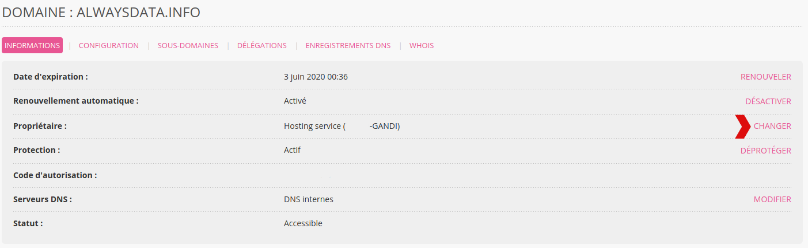

Rendez-vous dans **Domaines > Détails de [example.org] - 🔎 > CHANGER** (en face de **Propriétaire**). Vous arriverez sur un formulaire vous permettant de renseigner les informations du nouveau propriétaire.

Un email de confirmation est envoyé aux deux parties. __Vérifiez les adresses email avant de lancer l'opération__.

L'opération est payante pour les extensions suivantes : _.am_, _.be_, _.me.uk_.

Si vous souhaitez simplement mettre à jour l'adresse, le télépone ou encore l'adresse email, vous pouvez simplement faire une [mise à jour des informations du propriétaire](/fr/docs/domaines/mettre-a-jour-informations-proprietaire/).
