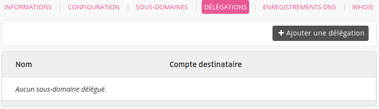
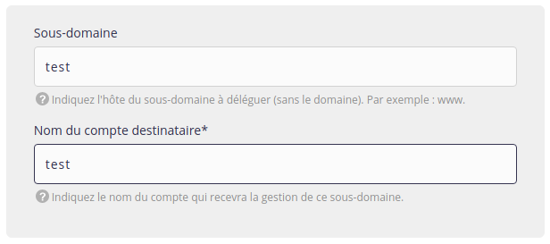
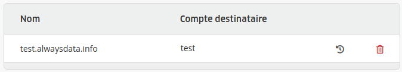

Pour permettre à un autre utilisateur d'alwaysdata de pouvoir utiliser un sous-domaine de votre domaine, il faut lui donner votre permission.

Pour ce faire, rendez-vous dans **Domaines > Détails de [example.org] - 🔎 > Délégations > Ajouter une délégation**.

> [!NOTE]
> Ne mettez pas la racine dans **Nom d'hôte**. 
> Par exemple, en indiquant `www.example.org` dans cette case, vous créerez une délégation pour `www.example.org.example.org`.

