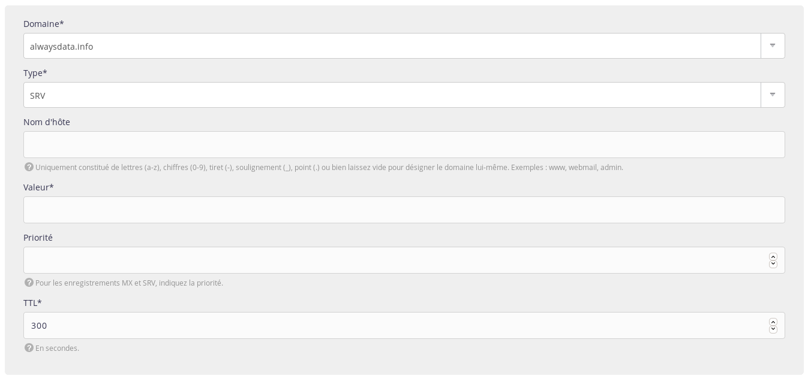

Un [enregistrement SRV](https://fr.wikipedia.org/wiki/Enregistrement_de_service) définit l'emplacement de services précis.

1.   Rendez-vous sur **Domaines > Details de [example.org] - 🔎 > Enregistrements DNS** ;
    

2.   Choisissez **Ajouter un enregistrement DNS** ;

3.   Renseignez le formulaire.
    

> [!WARNING] Attention
> Ne mettez pas la racine dans **Nom d'hôte**.
> Par exemple, en indiquant `www.example.org` dans cette case, vous créerez un enregistrement pour `www.example.org.example.org`.


## Quelques exemples

-   Configurer automatiquement un client mail avec `_autodiscover._tcp` :
    ```
    » Nom d'hôte : _autodiscover._tcp
    » Valeur : 0 443 adresse.serveur.mail
    » Priorité : 1
    » TTL : 300
    ```

-   Utiliser Lync (anciennement Skype) avec `_sip._tls` et `_sipfederationtls._tcp` :
    ```
    » Nom d'hôte : _sip._tls
    » Valeur : 1 443 sipdir.online.lync.com
    » Priorité : 100
    » TTL : 3600
    ```
    ```
    » Nom d'hôte: _sipfederationtls._tcp
    » Valeur: 1 443 sipfed.online.lync.com
    » Priorité: 100
    » TTL : 3600
    ```
