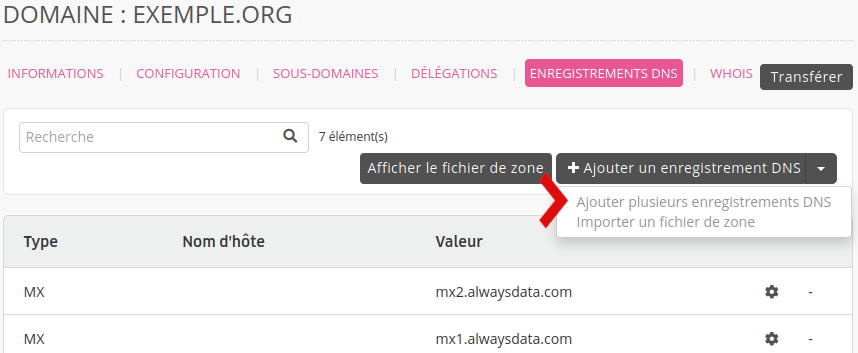
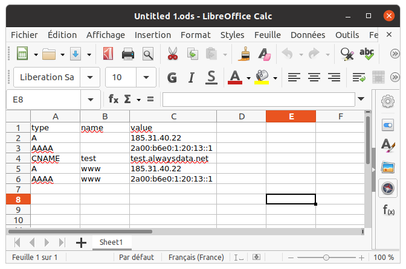

Pour ajouter plusieurs enregistrements DNS en une seule action, rendez-vous dans le menu **Domaines > Details de [example.org] -  ⚙️ > Enregistrements DNS > Ajouter plusieurs enregistrements DNS**.

Le fichier à importer devra être au format [CSV](https://fr.wikipedia.org/wiki/Comma-separated_values), que vous pouvez créer avec un logiciel de tableur - comme Microsoft Excel ou LibreOffice Calc. Exemple :

La première ligne du fichier doit impérativement contenir le nom du champ de chaque colonne. La [documentation API](https://api.alwaysdata.com/v1/record/doc/) reprend toutes les options possibles. Les champs non renseignés prendront la valeur par défaut.
