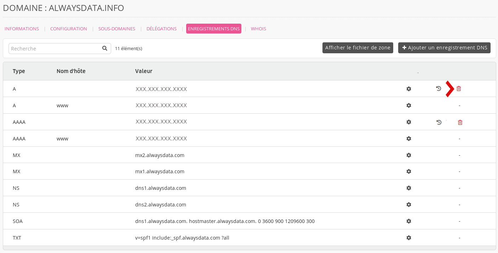

1. Allez dans **Domaines > Details de [example.org] - 🔎 > Enregistrements DNS** ;
2. Cliquez sur la **poubelle** correspondant à l'enregistrement à supprimer.

> [!NOTE]
> Les enregistrements créés par défaut par notre système (par exemple en ajoutant une adresse dans **Web > Sites**) ne sont pas _supprimables_ mais vous pouvez les _écraser_ en [ajoutant un enregistrement DNS](/fr/docs/domaines/gestion-dns/ajouter-un-enregistrement-dns/) pour le nom d'hôte concerné.
