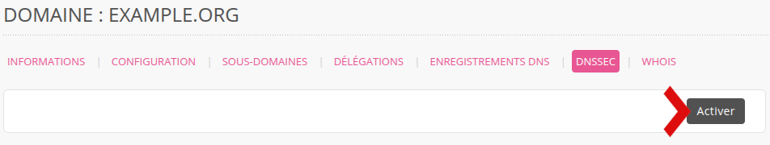
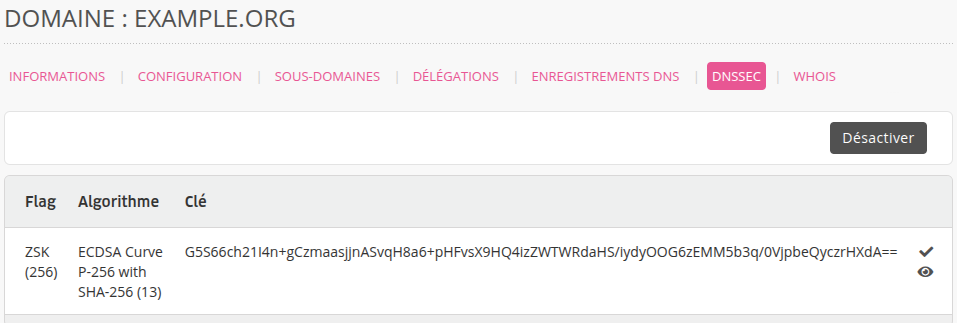
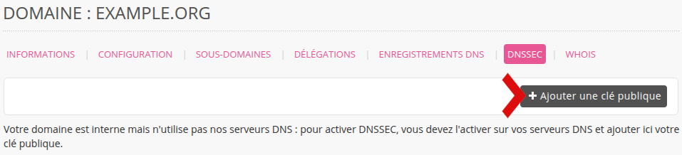
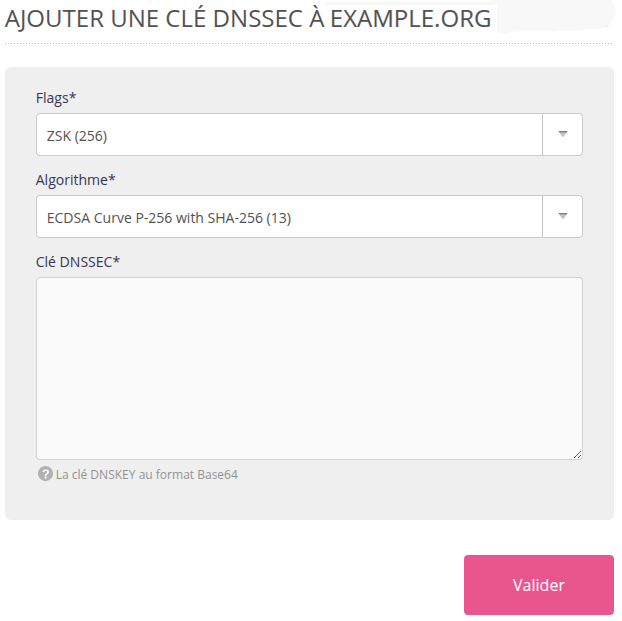
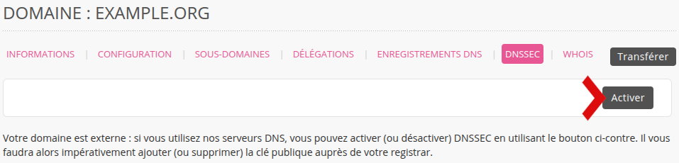
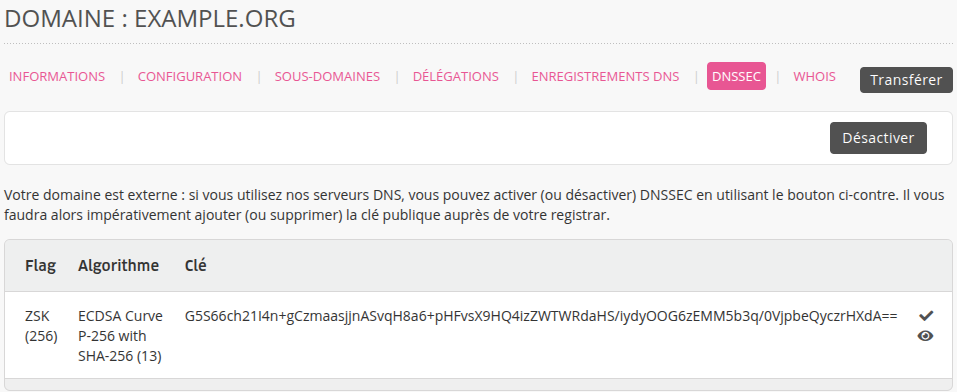

[DNSSEC](https://fr.wikipedia.org/wiki/Domain_Name_System_Security_Extensions) ajoute des signatures cryptographiques aux enregistrements DNS existants. Cela permet d'authentifier l'origine des données et de s'assurer qu'elles n'ont pas été modifiées en transit.

La mise en place de DNSSEC se fait à la fois sur les serveurs DNS autoritaires et sur le registrar d'un domaine :

- une clé privée doit être configurée sur les serveurs DNS autoritaires ;
- et sa clé publique, chez le registrar.

## Mise en place chez alwaysdata

Rendez-vous sur **Domaines > Details de [example.org] -  ⚙️ > DNSSEC**

### Le domaine est enregistré via alwaysdata et utilise les serveurs DNS d'alwaysdata

Cliquez sur **Activer**.

Cela créera la paire de clés qui sera configurée sur nos serveurs DNS et chez le registrar.

### Le domaine est enregistré via alwaysdata mais utilise des serveurs DNS externes

Créez la paire de clés chez votre prestataire DNS puis cliquez sur **Ajouter une clé publique** reprenant les éléments que vous donnera votre prestataire DNS.

Nous configurerons alors cette clé publique chez le registrar.

### Le domaine n'est pas enregistré via alwaysdata mais utilise les serveurs DNS d'alwaysdata

Cliquez sur **Activer**. Cela créera la paire de clés.

Copiez ensuite la clé et renseignez-la chez votre registrar.

## Liens
- [RFC 4033](https://datatracker.ietf.org/doc/html/rfc4033)
- [RFC 4034](https://datatracker.ietf.org/doc/html/rfc4034)
- [RFC 4035](https://datatracker.ietf.org/doc/html/rfc4035)
