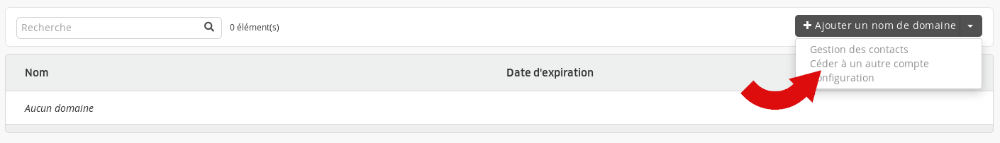
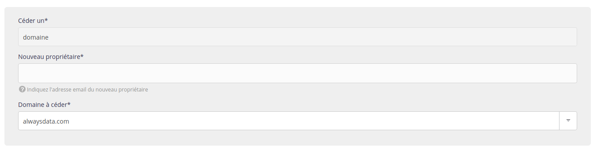
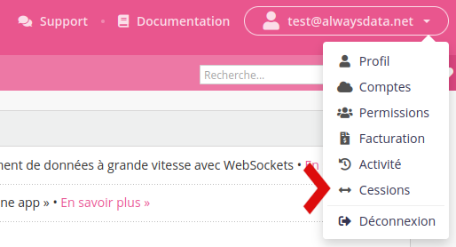

Cet article explique comment transférer un domaine _et_ ses adresses email sur **un autre compte alwaysdata**.

1. Dans le menu **Domaines** du compte initial ;

2. Choisissez l'action **Céder à un autre compte** ;

3. Et suivez les étapes.

> [!NOTE]
> Seul le _propriétaire du compte_ peut initier la cession.

Le profil destinataire devra simplement l'accepter dans la section **Cessions** et attendre que les boites email se copient sur son compte. Cette action étant dépendante de la taille des boites email, elle peut prendre du temps.

> [!TIP] Astuce
> Pour déplacer un domaine vers un compte appartenant au *même profil* avec lequel vous êtes connecté(e), il suffit d'indiquer votre adresse email.
