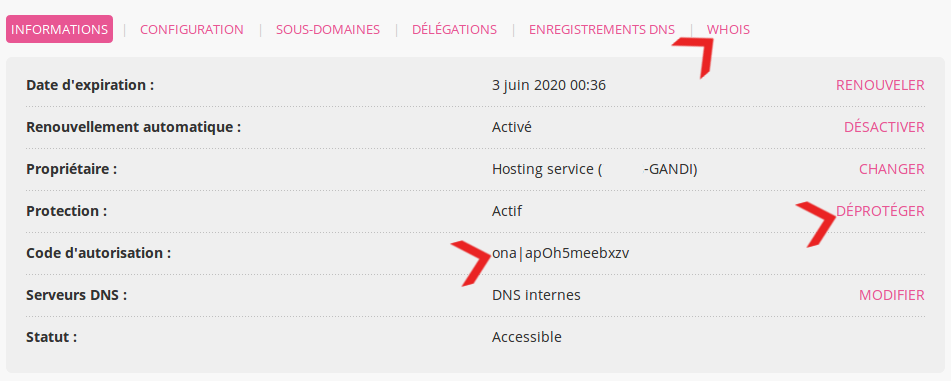

Pour transférer un domaine chez un autre prestataire, il faut initier la commande chez le nouveau prestataire.

## Préparation

Avant de lancer l'opération le propriétaire doit :

- enlever la protection contre les transferts ;
- vérifier que les informations du propriétaire sont correctes et visibles dans le `whois`[^1] ;
- récupérer le code d'autorisation.

Ces informations doivent se récupérer dans l'onglet **Domaines > Détails de [example.org] - 🔎** :

Il peut aussi désactiver [DNSSEC](/domains/dnssec/) pour éviter de *possibles* problèmes.
 
>[!NOTE]
Un transfert ne peut avoir lieu dans les 60 jours suivant sa création ou un précédent transfert.

[^1]: Plus d'informations sur [whois](https://fr.wikipedia.org/wiki/Whois)
