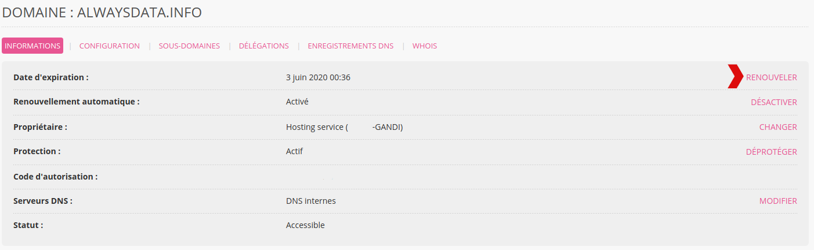
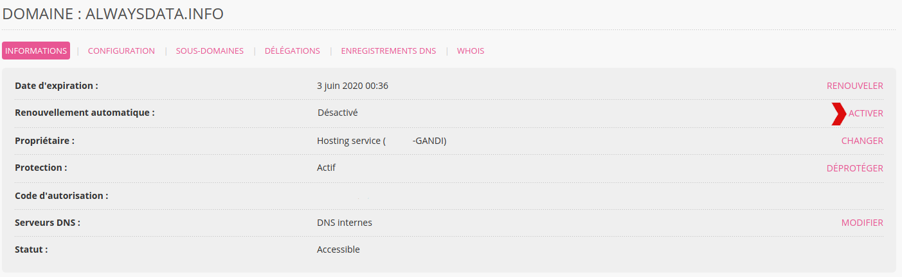
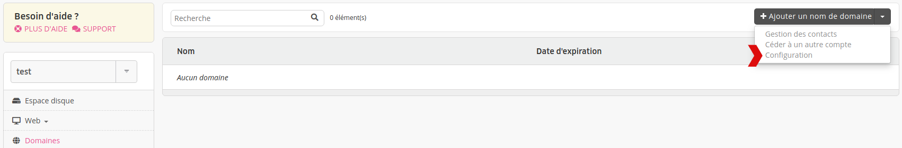
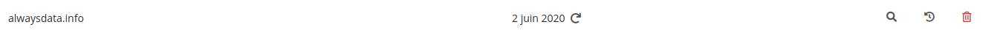

Rendez-vous dans **Domaines > Détails de [example.org] - 🔎 > RENOUVELER**.

- [Dates limites](/fr/docs/domaines/dates-limites/)

## Renouvellement automatique

Il se met en place via  **Domaines > Détails de [example.org] - 🔎 > ACTIVER** (en face de **Renouvellement automatique**).

Pour mettre en place le renouvellement automatique sur tous les nouveaux domaines d'un compte, rendez-vous dans **Domaines > Configuration** (accessible via le menu déroulant à droite de **Ajouter un domaine**).

Un domaine pour lequel le renouvellement automatique est activé a une icône l'indiquant :

Par défaut le renouvellement automatique aura lieu 30 jours avant expiration.

> [!WARNING] Attention
> Le renouvellement automatique de domaine ne peut avoir lieu que si le **compte prépayé** a le solde nécessaire pour le payer OU qu'une **carte bancaire** ou un **compte bancaire** est renseigné en prélèvement automatique. Pour mettre en place le prélèvement automatique rendez-vous dans le menu **Facturation > Moyens de paiement** de votre **Espace client**.

### Prélèvement automatique sur compte bancaire

Les prélèvements automatiques sur compte bancaire ne sont pas pris en compte immédiatement.

Pour éviter la suspension du domaine avant prise en compte du prélèvement, un délai de *15 jours* est donc mis en place entre la date d'activation du renouvellement automatique et la date d'expiration du domaine. Autrement dit, **si un domaine expire dans les 15 jours suivant le jour de l'activation du renouvellement automatique, il faudra le renouveler par vous-même**. Le système ne s'en occupera pas.
