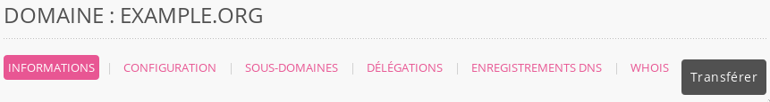
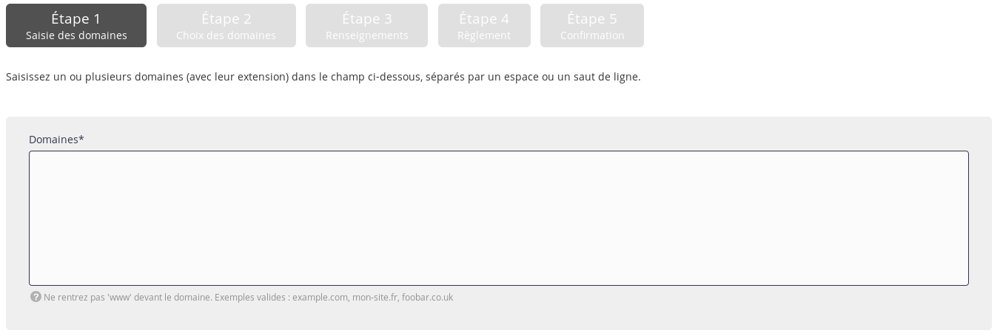
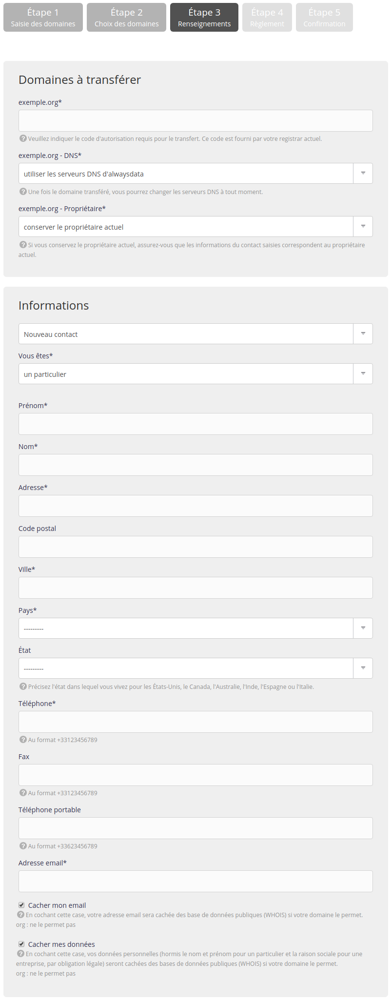

Opération [payante](https://www.alwaysdata.com/fr/domaines/#main), elle permet de transférer la gestion _administrative_ de son domaine chez alwaysdata.

> [!WARNING] Attention
> Si vous souhaitez transférer le domaine à un autre client alwaysdata, passez par un [déplacement de domaine](/fr/docs/domaines/deplacer-un-domaine/).

## Préparation en amont

Avant de lancer l'opération le propriétaire doit :

- enlever la protection contre les transferts ;
- vérifier que les informations du propriétaire sont correctes et visibles dans le `whois` [^1] ;
- obtenir le code d'autorisation ;
- récupérer une sauvegarde de ses données (notamment les emails).

Un transfert ne peut avoir lieu dans les 60 jours suivant sa création ou un précédent transfert.

> [!TIP] Astuce
> Le transfert de la [gestion technique](/fr/docs/domaines/ajouter-un-domaine-externe/) peut être effectué avant pour éviter d'être embêté par le temps pris par le transfert administratif.

## Lancement du transfert

1.  Dans votre interface d'administration, allez dans **Domaines > Ajouter un domaine** ;
    
    
    
    Si le domaine a déjà été [ajouté](/fr/docs/domaines/ajouter-un-domaine-externe/) à votre interface alwaysdata, vous pouvez le transférer via **Domaines > Détails** du domaine concerné **> Transférer**.
    
    

2.  Renseignez les noms de domaines que vous souhaitez acheter ;
   
    

> [!NOTE]
Saisissez uniquement le domaine, sans le sous-domaine.
> Par exemple : `example.org` et non `www.example.org`.

3.  Choisissez de le **transférer** ;
    

4. 
    - Indiquez le _code d'authorisation_ si l'extension le demande ;
    - Choisissez d'utiliser ou non nos serveurs DNS : cela entraîne le transfert de la gestion technique du domaine chez alwaysdata ;
    - Et entrez les informations du contact propriétaire. Ces informations dépendent de l'extension prise.
   
    

> [!WARNING] Attention
> Un email de validation est envoyé pour un certain nombre d'extensions. Sans validation, le transfert est abandonné.

> [!NOTE]
> Un transfert prend en moyenne 6 à 8 jours, cela peut être accéléré en contactant votre prestataire actuel.

### Cas particuliers

l'IPS Tag demandé par [Nominet](https://registrars.nominet.uk/) - le registre des `.uk` - est **GANDI**.

## Préparation du domaine

Durant ce temps, le domaine sera ajouté à votre interface d'administration en temps que _Domaine externe_ avec une opération en cours. Vous pourrez préparer nos serveurs en :

- mettant à jour vos [enregistrements DNS](/fr/docs/domaines/ajouter-un-enregistrement-dns/) si vous utilisez d'autres serveurs pour certains services ;
- créant les [adresses email](/fr/docs/emails/creer-une-adresse-email/).

Concernant le site internet, plusieurs choix sont possibles :

- ajouter les adresses avant qu'elles pointent sur nos serveurs. Dans ce cas, il peut y avoir un délai concernant la génération des [certificats SSL Let's Encrypt](/fr/docs/hebergement-web/sites/ssl-tls/certificats-lets-encrypt/) ;
- préparer le site sur une autre adresse et attendre le dernier moment pour ajouter les adresses au site. Il peut alors se passer un temps où le site n'est plus accessible.

---

## Liens

- [Transferts : code d'erreurs](/fr/docs/domaines/problemes-frequents/#transfert)

[^1]: Plus d'informations sur [whois](https://fr.wikipedia.org/wiki/Whois)
