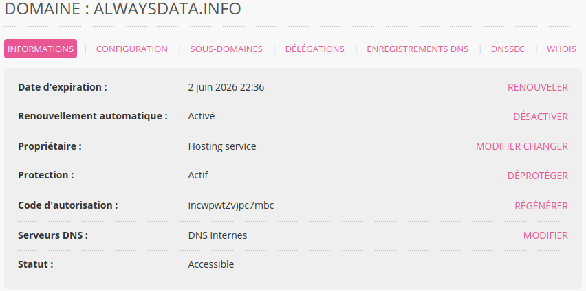

Chaque domaine est lié à un utilisateur propriétaire. Pour connaître quel utilisateur est lié à un domaine rendez-vous dans **Domaines > Détails de [example.org] - 🔎** :

Vous pourrez changer, via le bouton **MODIFIER** (en face de **Propriétaire**), l'adresse, l'email et le numéro de téléphone.

Pour modifier le nom du propriétaire ou l'entreprise tournez-vous vers le [changement de propriétaire](/fr/docs/domaines/changer-de-proprietaire/).
