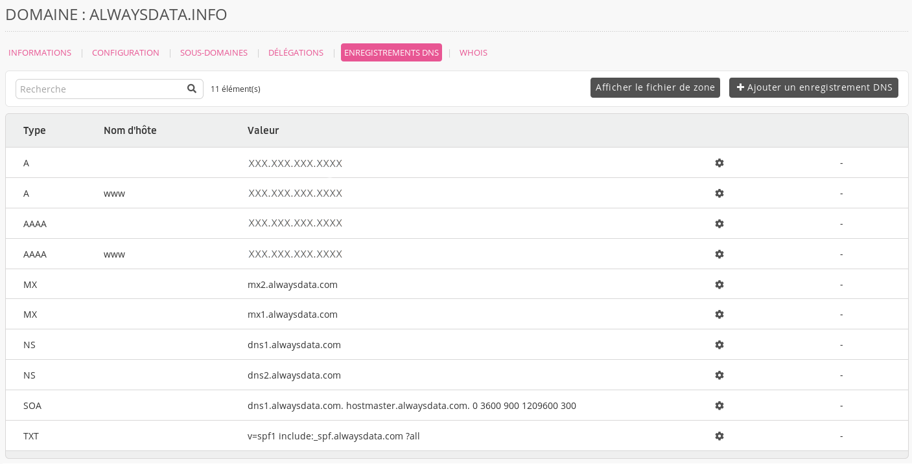
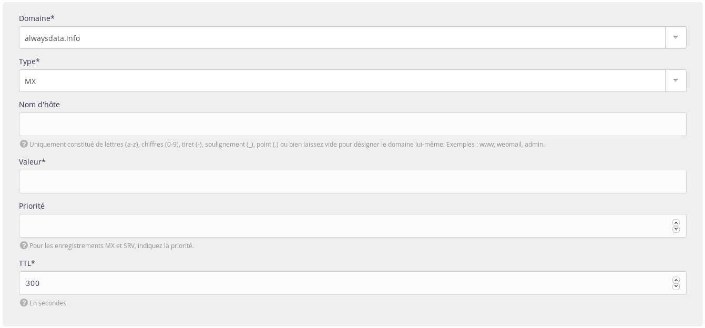

Pour utiliser le serveur de messagerie d'un autre prestataire, il faut changer d'[enregistrements MX](https://fr.wikipedia.org/wiki/Enregistrement_Mail_eXchanger). Ils determinent le serveur de réception d'un courrier électronique.

1. Allez dans **Domaines > Details de [example.org] - 🔎 > Enregistrements DNS** ;

2. Choisissez **Ajouter un enregistrement DNS** ;
3. Renseignez le formulaire.

Cela désactivera automatiquement nos enregistrements MX.

> [!WARNING] Attention
> Ne mettez pas la racine dans **Nom d'hôte**. Par exemple, en indiquant _example.org_ dans cette case, vous créerez un enregistrement pour _example.org.example.org_.

> [!NOTE]
> Un enregistrement ayant `@` comme nom d'hôte pour certains prestataires correspond au sous-domaine vide. Dans notre cas, la case **Nom d'hôte** devra être vide.

## Serveurs MX de différents prestataires

| Prestataire       | TTL   | Priorité | Valeur                                        |
|-------------------|-------|----------|-----------------------------------------------|
| Gandi             | 10800 | 10       | spool.mail.gandi.net                          |
|                   | 10800 | 50       | fb.mail.gandi.net                             |
| GSuite            | 3600  | 1        | aspmx.l.google.com                            |
|                   | 3600  | 5        | alt1.aspmx.l.google.com                       |
|                   | 3600  | 5        | alt2.aspmx.l.google.com                       |
|                   | 3600  | 10       | alt3.aspmx.l.google.com                       |
|                   | 3600  | 10       | alt4.aspmx.l.google.com                       |
| Microsoft Outlook | 3600  | 1        | [id_mx_microsoft].mail.protection.outlook.com |
| OVH               | 3600  | 1        | mx0.mail.ovh.net                              |
|                   | 3600  | 5        | mx1.mail.ovh.net                              |
|                   | 3600  | 50       | mx2.mail.ovh.net                              |
|                   | 3600  | 100      | mx3.mail.ovh.net                              |

> [!NOTE]
> `[id_mx_microsoft]` est généré aléatoirement par Microsoft selon le nom du domaine

## Outrepasser les serveurs MX

Il peut être utile de court-circuiter les MX externes pour joindre directement les MX d'alwaysdata.

Pour envoyer un email à `foobar@example.org` en passant par les MX d'alwaysdata (alors que les MX de `example.org` sont externes) :

- créez [l'adresse email](/e-mails/create-an-e-mail-address) sur l'interface d'administration ;
- envoyez un email à :
    - `foobar%example.org@mx.alwaysdata.com` si le compte est sur le Cloud Public ;
    - `foobar%example.org@serveur.alwaysdata.com` si le compte est sur un Cloud Privé (`serveur` à remplacer par le nom du serveur).
