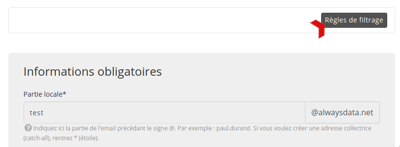
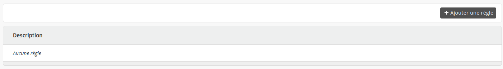
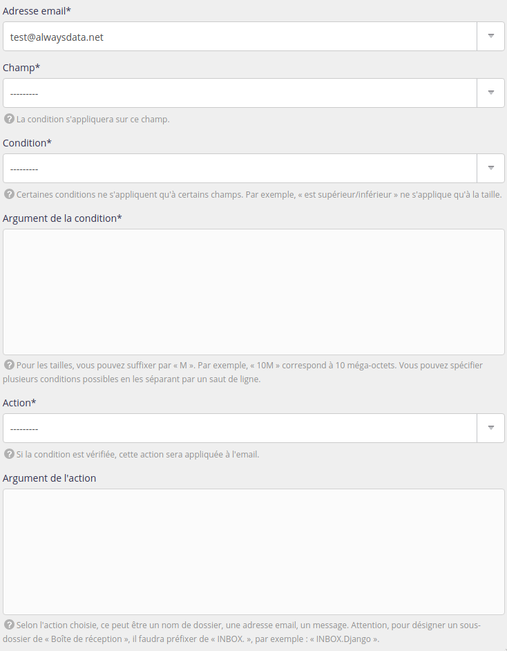

Pour mieux gérer ses emails et les trier automatiquement, on peut utiliser les règles de filtrage. Ces règles peuvent être créées au niveau du client email ou du serveur email.

Pour le faire sur ce dernier, rendez-vous dans **Emails > Adresses > Modifier** l'adresse voulue **> Règles de filtrage**.

Vous y retrouverez la liste de vos règles et pourrez en ajouter.

Les règles de filtrages sont traduites au format [Sieve](http://sieve.info/) que vous pourrez retrouver dans le fichier `/home/[compte]/admin/mail/[domaine]/[partie-locale]/filter.sieve` sur votre espace de fichiers.

> [!TIP] Astuce
> Pour créer des règles plus compliquées, ce sera des [règles Sieve](/fr/docs/emails/utiliser-les-scripts-sieve/).

---

- [Ressource API](https://api.alwaysdata.com/v1/mailbox/rule/doc/)
