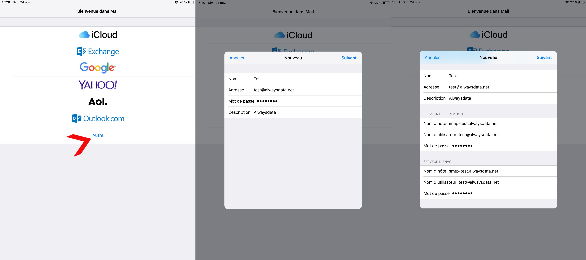

Dans nos exemples nous considérons les informations suivantes :

- Nom du compte : `test`
- Adresse email : `test@alwaysdata.net`

Elles sont à remplacer par vos informations de connexion personnelles :

|Serveur|Service|Information||
|---|---|---|---|
|Entrant|IMAP|Nom d'hôte|imap-*[compte]*.alwaysdata.net|
|||Port|993|
|||Nom d'utilisateur|Votre adresse email - par exemple *contact\@example.org*|
|||Mot de passe|Le mot de passe de votre adresse email|
|||Méthode d'authentification|Mot de passe normal|
||POP3|Nom d'hôte| pop-*[compte]*.alwaysdata.net|
|||Port| 995|
|||Nom d'utilisateur|Votre adresse email - par exemple *contact\@example.org*|
|||Mot de passe|Le mot de passe de votre adresse email|
|||Méthode d'authentification|Mot de passe normal|
|Sortant|SMTP|Nom d'hôte|smtp-*[compte]*.alwaysdata.net|
|||Port|465|
|||Nom d'utilisateur|Votre adresse email - par exemple *contact\@example.org*|
|||Mot de passe|Le mot de passe de votre adresse email|
|||Méthode d'authentification|Mot de passe normal|

> [!TIP] Astuce
> *[compte]* doit être remplacé par le nom de votre compte et *contact\@example.org* par votre adresse email. Ils sont définis dans le menu **Emails > Adresses** de notre interface d'administration.

## MacOS : application Mail

Rendez-vous dans **Fichier > Ajouter un compte > Autre compte Mail...**

- Indiquez les informations de connexion et choisissez entre IMAP ou POP pour le courrier _entrant_ ;
- Si vous recevez un message d'erreur SSL, cliquez quand même sur **Connecter**, vous pourrez ensuite renseigner de nouveau les informations de connexion.

Laissez l'authentification par mot de passe.

## iOS (iPhone, iPad) : application Mail

Rendez-vous dans **Réglages > Mots de passes et comptes > Ajouter un compte > Autre > Ajouter un compte mail**.

