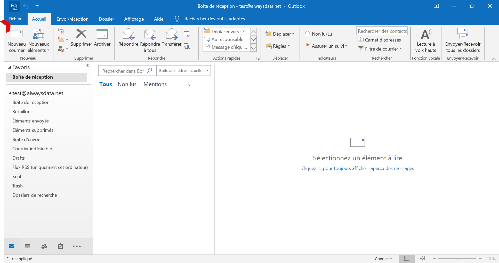
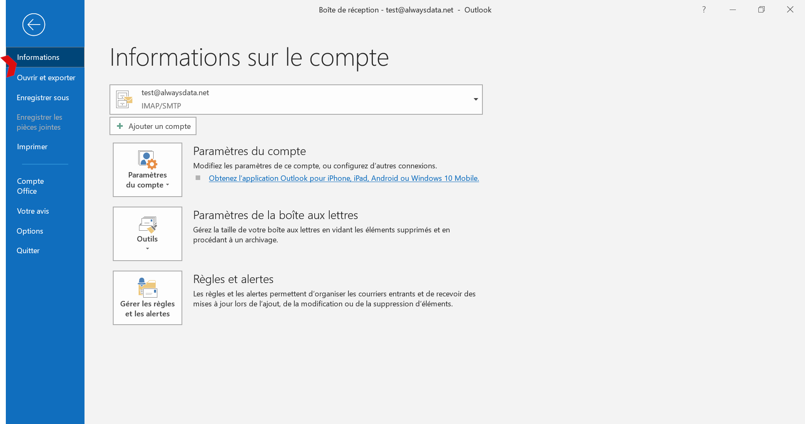
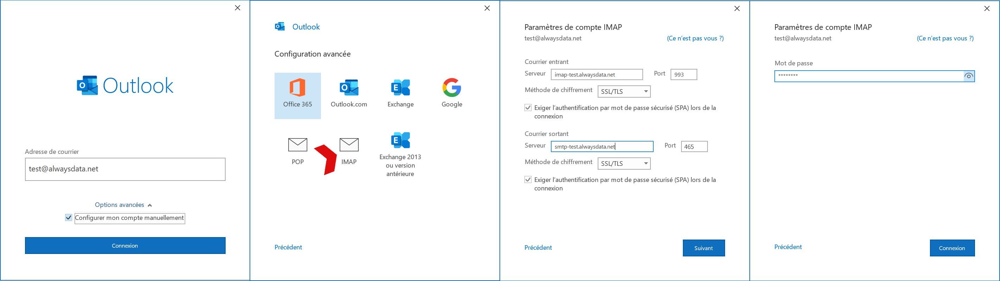
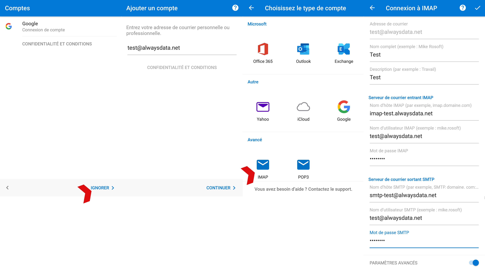

## Général

> [!TIP] Astuce
> Pour les domaines utilisant nos serveurs DNS, l'*autoconfiguration* Outlook est utilisable. Vous n'avez qu'à indiquer votre nom d'utilisateur (adresse email) et votre mot de passe. Les autres paramètres sont automatiquement générés.

|Serveur|Service|Information||
|---|---|---|---|
|Entrant|IMAP|Serveur|imap-*[compte]*.alwaysdata.net|
|||Port|993|
|||Méthode de chiffrement|Sera automatiquement choisi|
|||Méthode d'authentification|Exiger l'authentification par mot de passe sécurisé (SPA) lors de la connexion|
|||Adresse de courrier|Votre adresse email - par exemple *contact\@example.org*|
|||Mot de passe|Le mot de passe de votre adresse email|
||POP3|Serveur| pop-*[compte]*.alwaysdata.net|
|||Port| 995|
|||Méthode de chiffrement|Sera automatiquement choisi|
|||Méthode d'authentification|Exiger l'authentification par mot de passe sécurisé (SPA) lors de la connexion|
|||Adresse de courrier|Votre adresse email - par exemple *contact\@example.org*|
|||Mot de passe|Le mot de passe de votre adresse email|
|Sortant|SMTP|Serveur|smtp-*[compte]*.alwaysdata.net|
|||Port|465|
|||Méthode de chiffrement|Sera automatiquement choisi|
|||Méthode d'authentification|Exiger l'authentification par mot de passe sécurisé (SPA) lors de la connexion|
|||Adresse de courrier|Votre adresse email - par exemple *contact\@example.org*|
|||Mot de passe|Le mot de passe de votre adresse email|

*`[compte]`* doit être remplacé par le nom de votre compte et *`contact@example.org`* par votre adresse email. Ils sont définis dans le menu **Emails > Adresses** de notre interface d'administration.

## Captures d'écran

Dans notre exemple nous considérons les informations suivantes (à remplacer par vos informations de connexion personnelles) :

- Nom du compte : `test`
- Adresse email : `test@alwaysdata.net`

### Ordinateur

Rendez-vous dans **Fichiers > Informations > Ajouter un compte**.

- Configurez manuellement le compte ;
- Choisissez entre POP et IMAP ;
- Cochez les cases **Exiger l'authentification par mot de passe sécurisé (SPA) lors de la connexion**.

### Mobile

Rendez-vous sur **C'est parti > Ignorer** si on propose des types de comptes **> Avancé IMAP** ou **POP3**.

Cliquez sur **Paramètres avancés** pour indiquer les _noms d'hôtes_.
