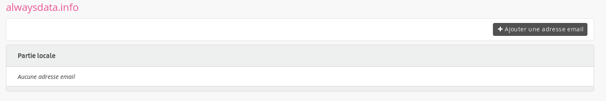
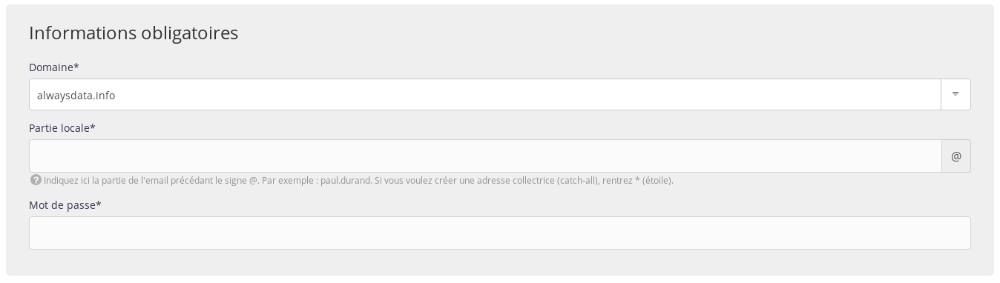
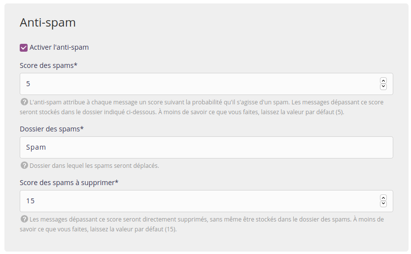
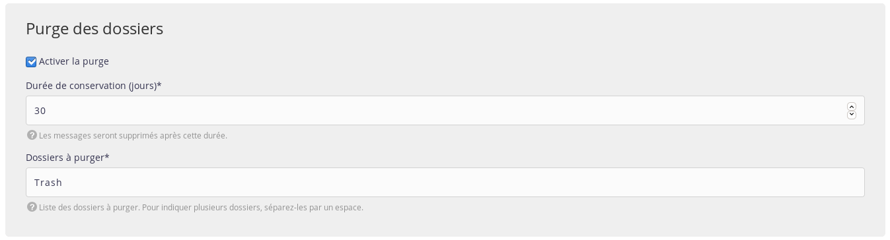
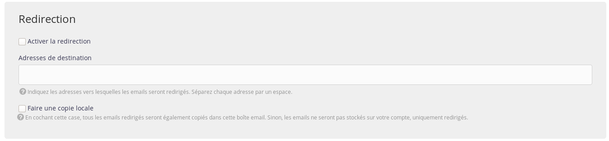
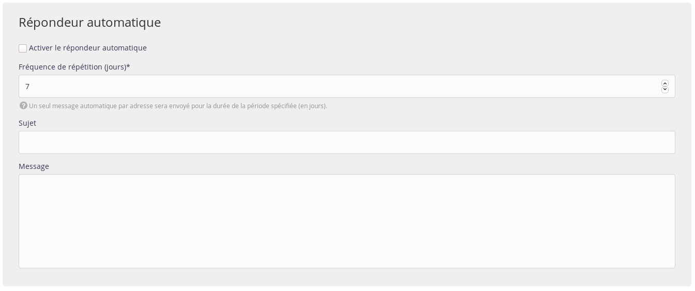
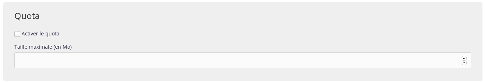
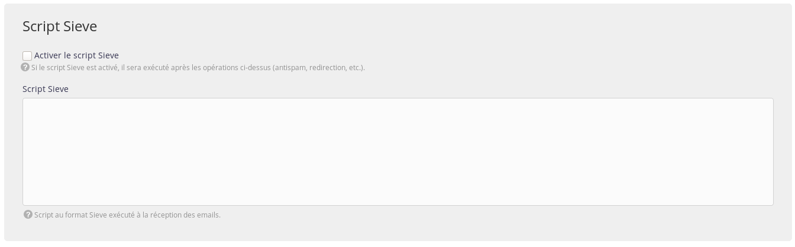

À partir de la section **Emails > Adresses** de l'administration, vous pouvez créer des boîtes emails (à condition d'avoir ajouté un [nom de domaine](/fr/docs/domaines/)).

- Pour en faire plusieurs en même temps, utilisez la [création par fichier CSV](/fr/docs/emails/creer-une-adresse-email/creer-des-adresses-email-via-csv/).

- Vous pouvez aussi [migrer simplement depuis un autre hébergeur](/fr/docs/emails/creer-une-adresse-email/migrer-des-adresses-email-chez-alwaysdata/).

Vous aurez un ensemble de champs à renseigner. En voici les précisions.

## Informations obligatoires

- _Domaine_ : nom de domaine de l'adresse à créer ;
- _Partie locale_ : partie à gauche du *@* de l'adresse email (par exemple, si vous voulez créer `contact@example.org`, la partie locale sera `contact`). Vous pouvez aussi créer une [adresse collectrice (catch-all)](/fr/docs/emails/creer-une-adresse-email/adresse-collectrice/).
- _Mot de passe_ : mot de passe nécessaire pour la connexion à cette adresse email.

## Antispam

L'antispam utilisé pour filtrer le courrier électronique publicitaire non souhaité (_spam_) est le logiciel libre [Rspamd](https://rspamd.com/).

> [!WARNING] Attention
> L'antispam paramétrable est l'antispam des courriers entrants. Les emails sortant de nos serveurs passent obligatoirement par un antispam non-paramétrable.

- _Score_ : l'anti-spam attribue à chaque message un score suivant la probabilité qu'il s'agisse d'un spam. Les messages dépassant ce score seront stockés dans un dossier. Plus le score est bas, plus un email a la possibilité d'être marqué comme spam, il est donc préférable de laisser la valeur par défaut ;
- _Dossier_ : dossier dans lequel les spams seront déplacés. Le dossier par défaut est `Spam` ;
- _Score des spams à supprimer_ : les messages dépassant ce score seront directement supprimés, sans même être stockés dans le dossier des spams. À moins de savoir ce que vous faites, laissez la valeur par défaut.

L'antivirus [ClamAV](http://www.clamav.net/) est inclus à Rspamd pour filtrer le courrier électronique potentiellement infecté.

## Purge des dossiers

- _Durée de conservation_ : après cette durée, les messages seront définitivement effacés ;
- _Dossiers_ : liste de dossiers à purger (séparés par un espace).

> [!NOTE]
> Cette fonctionnalité est pertinente lors de l'utilisation de l'antispam et/ou l'antivirus : il est de votre initiative de vider leurs dossiers régulièrement.

## Redirection

- _Adresses_ : adresses vers lesquelles les emails seront redirigés (séparées par un espace) ;
- _Copie locale_ : en cochant cette case, tous les emails redirigés seront également copiés dans cette boîte email. Sinon les emails ne seront pas stockés, uniquement redirigés.
	- Si cette case n'est pas cochée, on créé donc un [alias](https://fr.wikipedia.org/wiki/Alias_(adresse_%C3%A9lectronique)).

> [!NOTE]
> Si vous utilisez l'antivirus et/ou l'antispam, les emails considérés comme frauduleux ne sont jamais redirigés, afin d'éviter de relayer ces mauvais messages vers des fournisseurs externes.

> [!WARNING] Attention
> Les serveurs mails d'alwaysdata ne sont pas forcément autorisés par les règles d'authentification (SPF, DKIM, DMARC) des expéditeurs. Cela peut bloquer les redirections.

## Réponse automatique

- _Fréquence de répétition_ : un seul message automatique par adresse sera envoyé pour la durée de cette période (en jours) ;
- _Sujet_ : sujet du message automatique ;
- _Message_ : corps du message automatique.

## Quota

- _Taille_ : taille maximale de la boîte email, en Mo (si ce quota est atteint, les nouveaux messages seront refusés).

> [!NOTE]
> Sans précision de la taille maximum d'une boîte email, c'est l'espace disponible du pack qui fera office de plafond.

## Script Sieve

Cette technologie permet d'effectuer des [opérations plus précises](/fr/docs/emails/emails-entrants/utiliser-les-scripts-sieve/) à la réception de vos messages. Si vous activez le script Sieve, alors son exécution aura lieu après toutes les opérations configurées sur le formulaire de création de votre boîte email.
