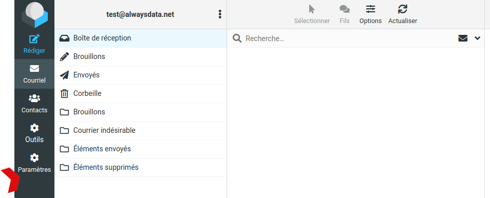
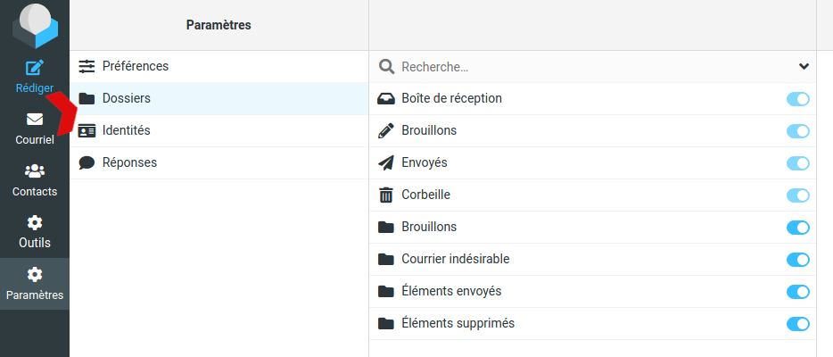

## Limite du nombre d'envoi de mails

Il n'y a pas de limites mais lors d'un envoi important, tous les emails ne partiront pas en même temps. Ils seront envoyés "au fil de l'eau".

Le spam est totalement interdit.

## Certains dossiers ne sont pas visibles sur le webmail

Rendez-vous dans **Paramètres > Dossiers**, les dossiers non visibles ne doivent pas être cochés :

