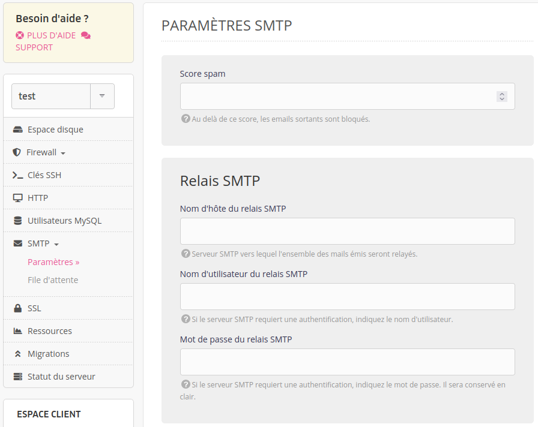

Le relais SMTP permet d'utiliser un serveur tiers externe pour l'envoi des emails. Cela peut, par exemple, être utile pour :

- ne pas toucher à la réputation de votre serveur alwaysdata ;
- profiter de services spécialisés.

Cette option est disponible sur les [offres Cloud Privés](/fr/docs/admin-facturation/facturation/prix-cloud-prive/) d'alwaysdata.

## Mise en place

Rendez-vous dans le menu **SMTP > Paramètres** de votre serveur, puis renseignez les informations d'authentification du relais SMTP choisi.

Tous les emails devant partir du serveur partiront désormais du serveur relais.
