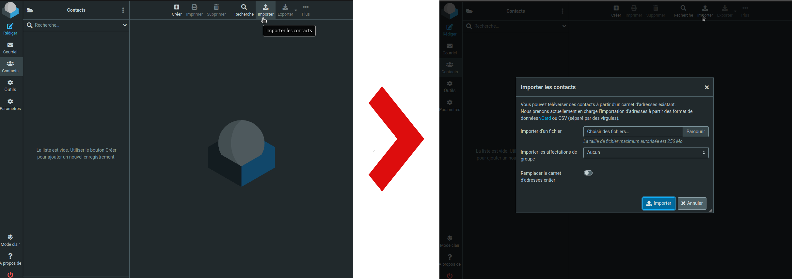
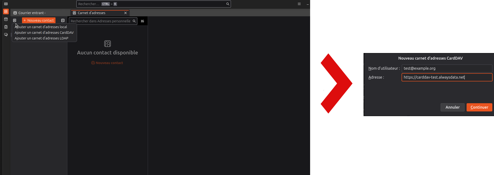
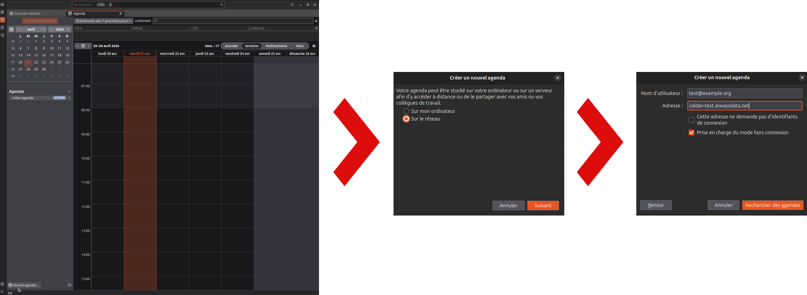
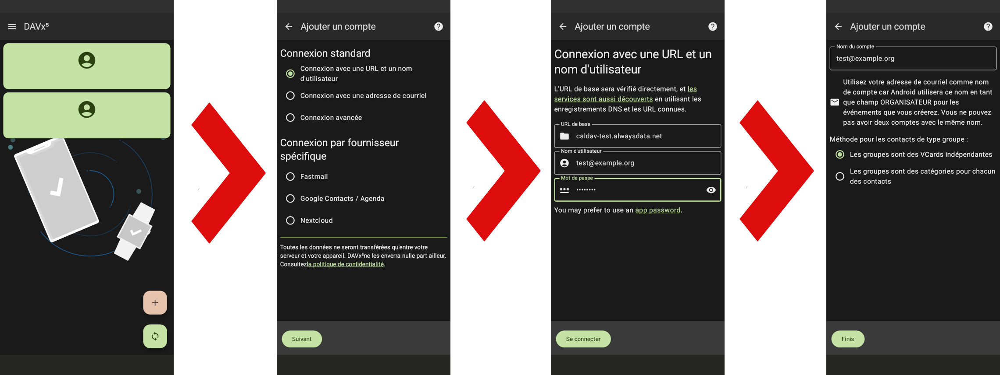

 
Chaque adresse email dispose de son propre carnet d'adresses et d'un agenda. Les utilisateurs peuvent y accéder et les gérer depuis les logiciels de leurs choix et sur plusieurs logiciels simultanément.
 
|Service|Nom d'hôte|
|---|---|
|CardDAV (carnet d'adresses)|carddav-[compte].alwaysdata.net|
|CalDAV (agenda)|caldav-[compte].alwaysdata.net|
||Identifiant : **adresse email** et **mot de passe** associé |

Le partage n'est *pas* disponible.
 
## Webmail
 
Le carnet d'adresses est directement accessible via le menu **Contacts** et le calendrier via le menu **Calendrier**.
 
Les groupes créés sont transformés par le système comme des vCards indépendantes assurant une synchronisation simple avec d'autres clients CardDAV.
 
### Importer son carnet d'adresses
 
Roundcube permet d'importer des adresses à partir de fichiers [CSV](https://fr.wikipedia.org/wiki/Comma-separated_values) ou [vCard](https://fr.wikipedia.org/wiki/VCard). Rendez-vous dans **Contacts > Importer**.
 

 
## Mise en place sur différentes applications
 
### Mozilla Thunderbird
 
#### Carnet d'adresses
 
Rendez-vous sur **Carnet d'adresses > Créer un nouveau carnet d'adresses > Ajouter un carnet d'adresses CardDAV**
 

 
#### Agenda
 
Rendez-vous sur **Agenda > Nouvel agenda... > Sur le réseau > Rechercher des agendas**
 

 
### DAVx5 (application Android)
 
Rendez-vous sur **Ajouter un compte ➕​ > Connexion standard (Connexion avec une URL et un nom d'utilisateur)**
 

