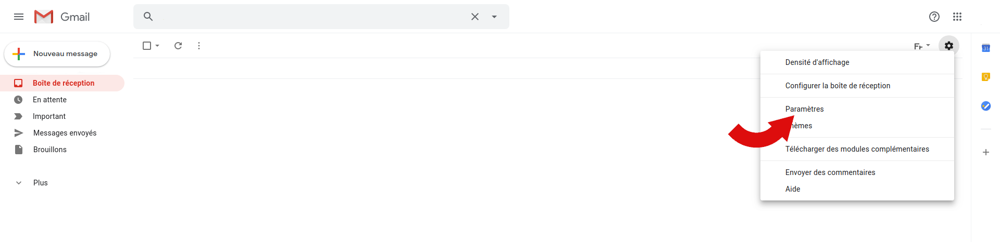
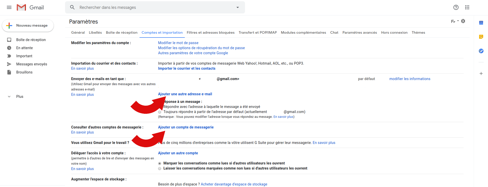
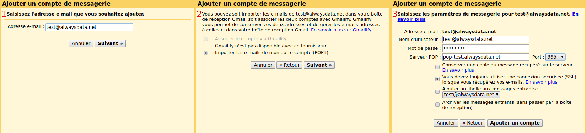
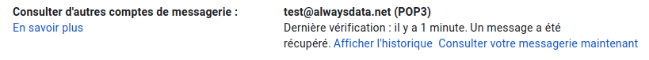
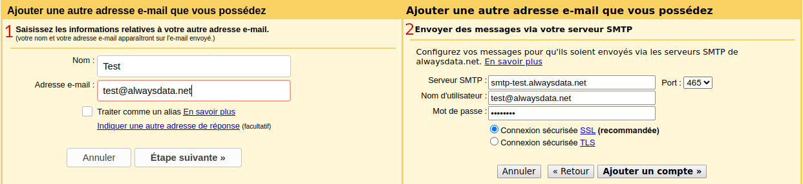
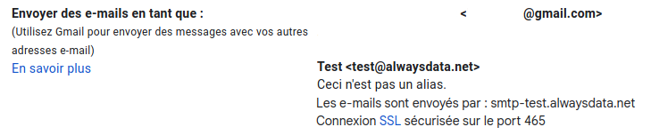
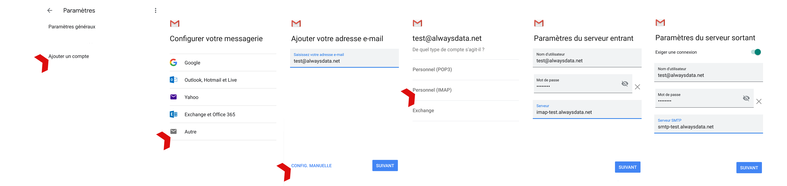

Dans nos exemples nous considérons les informations suivantes :

- Nom du compte : `test`
- Adresse email : `test@alwaysdata.net`

Elles sont à remplacer par vos informations de connexion personnelles :

|Serveur|Service|Information||
|---|---|---|---|
|Entrant|POP3|Serveur POP|pop-*[compte]*.alwaysdata.net|
|||Nom d'utilisateur|Votre adresse email - par exemple *contact\@example.org*|
|||Mot de passe|Le mot de passe de votre adresse email|
|||Port|995|
|Sortant|SMTP|Serveur SMTP|smtp-*[compte]*.alwaysdata.net|
|||Nom d'utilisateur|Votre adresse email - par exemple *contact\@example.org*|
|||Mot de passe|Le mot de passe de votre adresse email|
|||| Ne pas traiter comme un alias|
|||Port|465|
||||Connexion sécurisée|

> [!TIP] Astuce
> Remplacez *contact\@example.org* par votre adresse email. Elle est définie dans le menu **Emails > Adresses** de notre interface d'administration.

## Navigateur web

Rendez-vous dans **Paramètres > Comptes et importation**.

### Courrier entrant (IMAP/POP)

Rendez-vous dans **Ajouter un compte de messagerie > Importer les e-mails de mon autre compte (POP3)** ;

Cochez "Vous devez toujour utiliser une connexion sécurisée (SSL) lorsque vous récupérez vos emails".

> [!WARNING] Attention
> Attention c'est une connexion POP3 qui va récupérer sur ses serveurs les emails.

    
### Courrier sortant (SMTP)

Rendez-vous dans **Ajouter une autre adresse e-mail**.

-  Décochez la case **Traiter comme un alias**.

## Mobile

Rendez-vous dans **Paramètres > Ajouter un compte > Autre**.

- Pour le courrier _sortant_, cochez la case **Exigez une connexion**.
