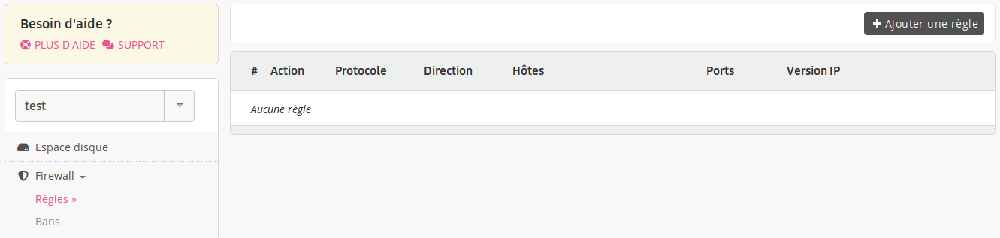
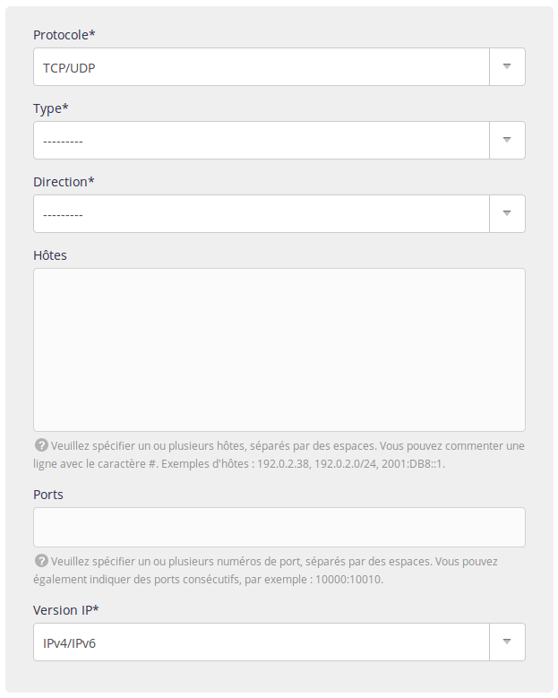
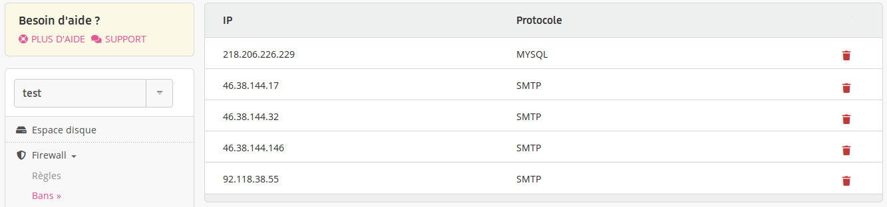
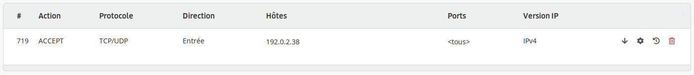
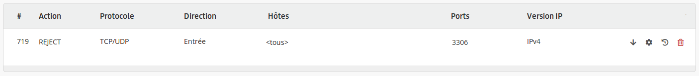

Le firewall (pare-feu) se gère dans le menu **Firewall** du serveur.

## Règles
Menu pour retrouver, créer et ajuster ses règles de firewall.

Si vous avez plusieurs règles, la règle placée la plus en haut aura autorité sur les autres.

- [Ressource API](https://api.alwaysdata.com/v1/firewall/doc/)

### Ajouter une règle
Pour ajouter une règle, choisissez :

- le protocole : [UDP](https://fr.wikipedia.org/wiki/User_Datagram_Protocol) ou [TCP](https://fr.wikipedia.org/wiki/Transmission_Control_Protocol) ;
- le type de règle : ACCEPT, DROP (rejeter sans avertir l'émetteur) ou REJECT ;
- la direction : entrée ou sortie ;
- les IP/hôtes concernés : cela peut être des IP ou des URLs ;
- les ports ;
- la version des IP.

Ne rien mettre dans *Hôtes* et *Ports* va activer la règle pour tous sauf si une règle supérieure indique le contraire.

Il est possible de donner un label par règles (**Annotations**) et directement dans les règles en utilisant le caractère `#`.

> [!NOTE]
> Pour indiquer tous les ports vous pouvez laisser vide ou indiquer la plage `0:65535`.

## Banissements firewall
Vous y retrouverez les IP actuellement bannies et les services sur lesquels elles le sont.

Si vous vous retrouvez bloqués sur un service, vérifiez ce menu et supprimez votre IP si elle est bannie et ajoutez la règle nécessaire.

> [!TIP] Astuce
> Le banissement dure 10 minutes par défaut et a lieu après une cinquantaine d'échecs de connexion.

## Services

Ce menu permet d'ouvrir ou fermer automatiquement les ports des fonctionnalités connues (FTP, mails, SSH, bases de données...). Il n'est alors plus nécessaire de créer la règle par soi-même.

## Exemples

### Autoriser sa propre IP à n'être bloquée sur aucun port entrant

| Intitulé   | Valeur                                           |
|------------|--------------------------------------------------|
| Protocole  | UDP/TCP                                          |
| Type       | ACCEPT                                           |
| Direction  | Entrée                                           |
| Hôtes      | \<votre IP>                                      |
| Ports      | \<ne rien indiquer>                              |
| Version IP | IPv4, IPv6 ou IPv4/IPv6 (selon les IP indiquées) |

### Bloquer le port MySQL sur l'extérieur

| Intitulé   | Valeur                                           |
|------------|--------------------------------------------------|
| Protocole  | UDP/TCP                                          |
| Type       | REJECT                                           |
| Direction  | Entrée                                           |
| Hôtes      | \<ne rien indiquer>                              |
| Ports      | 3306                                             |
| Version IP | IPv4/IPv6                                        |

