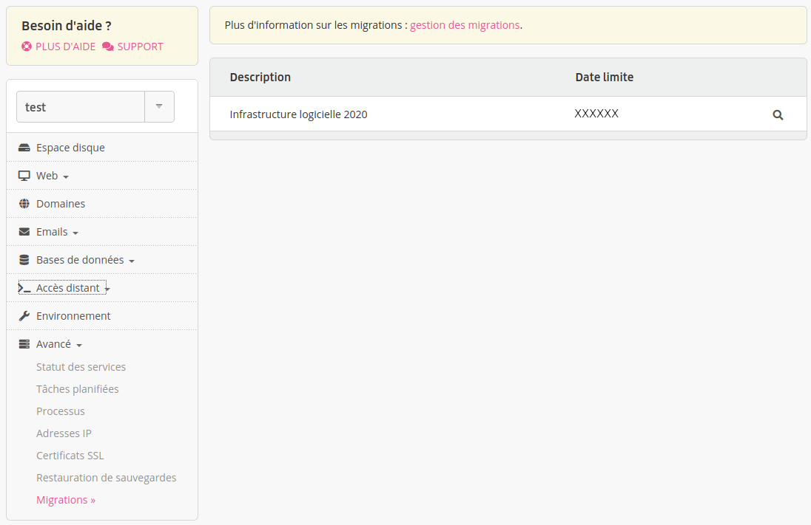

Une migration est une opération qui consiste à faire évoluer une caractéristique technique de votre compte. Par exemple, une migration vers une nouvelle version de MySQL.

Les migrations disponibles apparaissent dans le menu **Avancé > Migrations** de l'[administration alwaysdata](https://admin.alwaysdata.com). De nouvelles migrations sont ajoutées régulièrement et nous avertissons nos utilisateurs par email pour les informer.

Certaines migrations sont facultatives : nous vous laissons le choix de l'effectuer ou non. D'autres migrations sont obligatoires : vous disposez alors d'un certain temps pour les effectuer. Une fois la date limite atteinte, les migrations non effectuées le seront automatiquement.

- [Effectuer une migration](/fr/docs/caracteristiques-techniques/migrations/effectuer-une-migration)
- [Migrations Cloud Privé](/fr/docs/caracteristiques-techniques/migrations/migration-cloud-prive)

## Migrations actuellement proposées

* [MariaDB 11.4](/fr/docs/caracteristiques-techniques/migrations/mariadb-11_4)
* [MariaDB 11.8](/fr/docs/caracteristiques-techniques/migrations/mariadb-11_8)
* [PostgreSQL 17](/fr/docs/caracteristiques-techniques/migrations/postgresql-17)
* [PostgreSQL 18](/fr/docs/caracteristiques-techniques/migrations/postgresql-18)

## Anciennes migrations

* [Infrastructure logicielle 2024](/fr/docs/caracteristiques-techniques/migrations/architecture-logicielle-2024)
* [Infrastructure logicielle 2020](/fr/docs/caracteristiques-techniques/migrations/architecture-logicielle-2020)
* [Infrastructure logicielle 2017](/fr/docs/caracteristiques-techniques/migrations/architecture-logicielle-2017)
