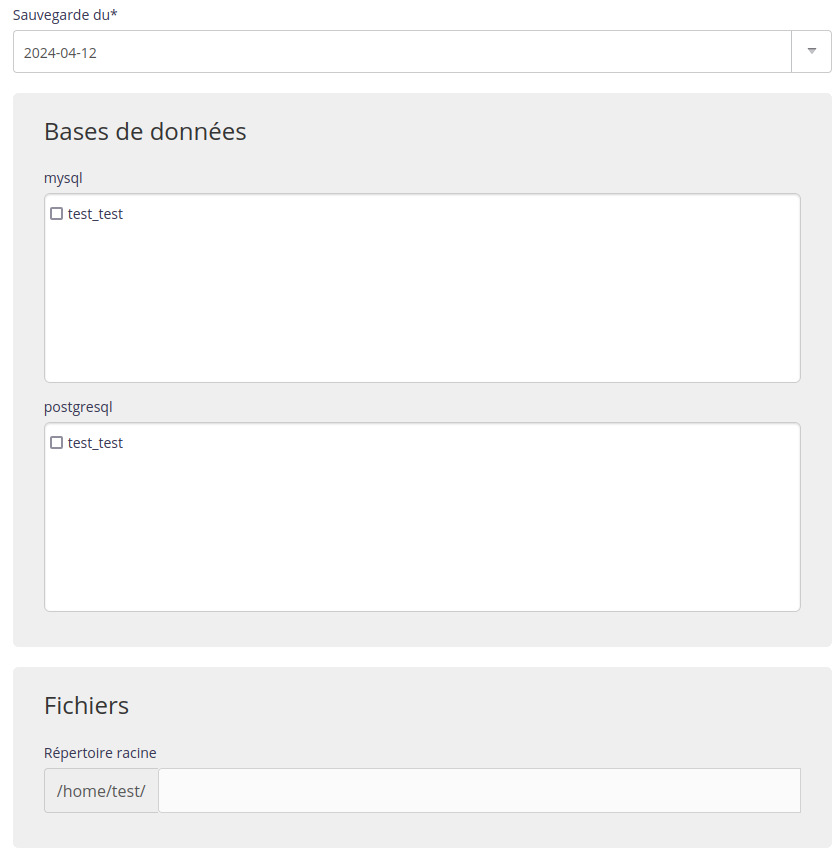

Les sauvegardes de vos fichiers et bases de données se trouvent dans le répertoire `/home/[compte]/admin/backup` de votre compte. Vous pouvez les restaurer via le menu **Avancé > Restauration de sauvegardes**.

1. Choisissez la date voulue ;
    

2. Puis cochez la/les base(s) de données et/ou le/les répertoire(s) voulu(s) [^1].
    

> [!WARNING] Attention
> La restauration va écraser la configuration actuelle, effectuez donc auparavant une sauvegarde.


> [!NOTE]
> Le temps de restauration dépend de la taille des fichiers à restaurer.


## En SSH

Si vous souhaitez restaurer une sauvegarde manuellement.

- Connectez-vous à votre compte [en SSH](/fr/docs/hebergement-web/acces-distant/ssh/) ;

- Restaurez des fichiers :

    ```sh
    $ rsync -av --delete /home/[compte]/admin/backup/[date]/files/[répertoire]/ /home/[compte]/[répertoire]/
    ```

> [!WARNING] Attention
> `--delete` va supprimer tous les fichiers de ce répertoire ayant été créés depuis la date de la sauvegarde.
> Pour effectuer un test ajoutez `-n`.


- Restaurer une base de données MySQL :

    ```sh
    $ zstdcat /home/[compte]/admin/backup/[date]/mysql/[base].sql.zst | mysql -h mysql-[compte].alwaysdata.net -u [utilisateur] -p [base]
    ```

- Restaurer une base de données PostgreSQL :

    ```sh
    $ zstdcat /home/[compte]/admin/backup/[date]/postgresql/[base].sql.zst | psql -h postgresql-[compte].alwaysdata.net -U [utilisateur] -W -d [base]
    ```

> [!TIP] Astuce
> Les contenus archivés (e.g. les dumps de BDD) dans votre espace de *backup* sont au format [Zstandard](https://github.com/facebook/zstd), vous pouvez utiliser les [outils `zstd*` officiels](https://github.com/facebook/zstd/releases/latest) ou le [plugin adapté pour 7zip](https://www.tc4shell.com/en/7zip/modern7z/) pour les manipuler.


[^1]: Il n'est pas obligatoire de restaurer à la fois bases et fichiers.
