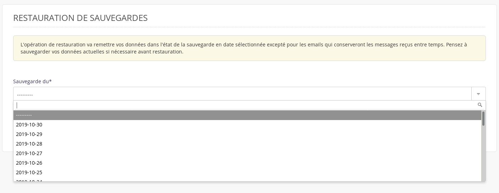
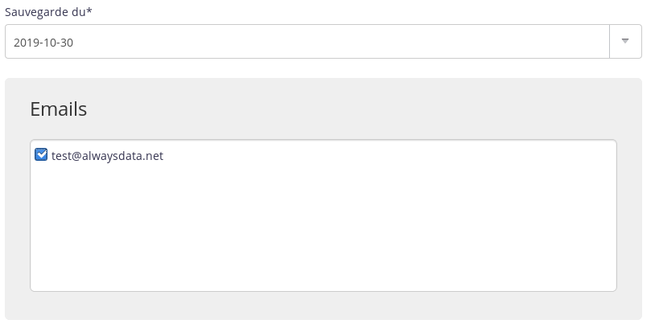

Les sauvegardes de vos emails se trouvent dans le répertoire `$HOME/admin/backup` de votre compte. Vous pouvez les restaurer via le menu **Avancé > Restauration de sauvegardes**.

> [!NOTE]
> Les emails à la date de la sauvegarde seront remis en place. Aucun email reçu ou envoyé depuis ne sera supprimé.


1.  Choisissez la date voulue ;
    

2.   Puis cochez la/les boîte(s) email(s).
    

> [!NOTE]
> Le temps de restauration dépend de la taille des fichiers à restaurer.


## En SSH

Si vous souhaitez restaurer une sauvegarde manuellement.

- Connectez-vous à votre compte [en SSH](/fr/docs/hebergement-web/acces-distant/ssh/) ;

- Restaurer des emails :

    ```sh
    $ rsync -av $HOME/admin/backup/[date]/mails/[domaine]/[boîte_email]/ $HOME/admin/mail/[domaine]/[boîte_email]/
    ```
