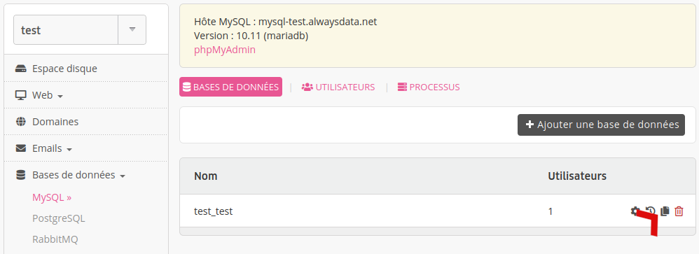
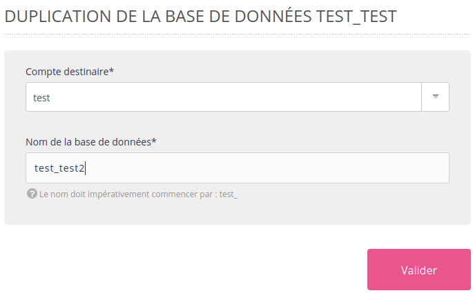
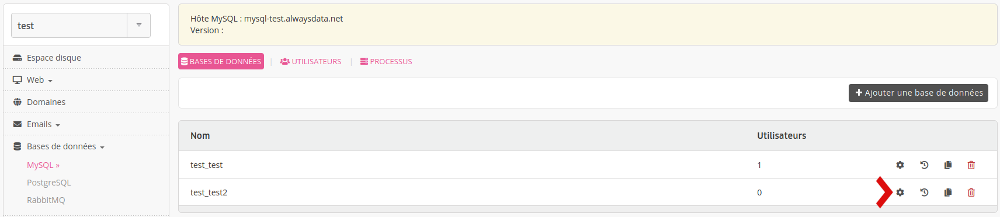
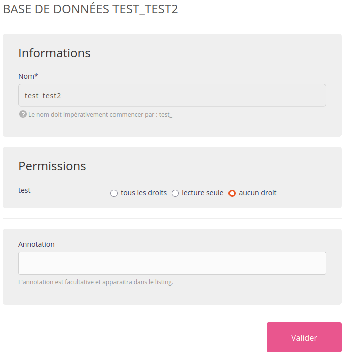

Il est possible de dupliquer une base de données via **Bases de données > [SGBD] > Dupliquer la [base de donnée] - 📄**.

Choisissez le compte destinataire et le nom de la nouvelle base.

À la création de cette nouvelle base, aucun utilisateur du compte n'a de droit dessus. Il faudra choisir les permissions pour chaque utilisateur du compte via **Bases de données > [SGBD] > Modifier [la base voulue] - ⚙️**.

