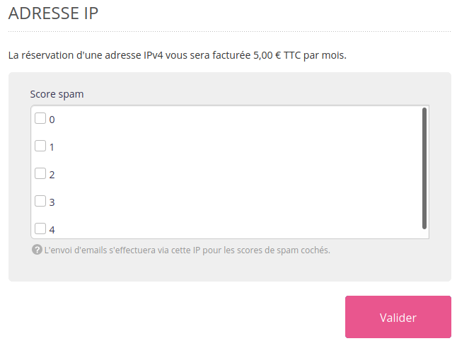

Quel que soit l'environnement pris[^1], des adresses IPv4 sont offertes à la location via le menu **Avancé > Adresses IP**. Ces IP - non partagées - sont facturées 5 € TTC par mois ou 60 € TTC par an[^2].

## HTTP

Une fois l'IP prise :

- Si le domaine est géré sur nos serveurs DNS, vous pourrez la lier à une adresse via **Avancé > Adresses IP** ;
- Si le domaine utilise d'autres serveurs DNS, créez un **enregistrement DNS de type A** pointant sur l'IP privée chez votre prestataire DNS.

> [!NOTE]
> Cette IP servira pour les requêtes entrantes mais les requêtes sortantes passeront toujours par l'IP du serveur HTTP sur lequel est le compte. Cette IP est donnée dans le menu **Avancé > Statut des serveurs**.

## SMTP

Cette IP va servir à l'envoi des mails.

Une fois l'IP prise vous pourrez lui indiquer quels emails doivent passer par cette IP selon le [score qu'ils auront reçus par l'antispam](/fr/docs/emails/emails-sortants/delivrabilite-bonnes-pratiques/#système-de-notation) :

> [!NOTE]
> Plus la note est basse mieux l'email sera noté.

[^1]: Disponibles sur toutes nos offres, ces IP ne sont pas à confondre avec nos [offres Cloud Privé](/fr/docs/admin-facturation/facturation/choisir-son-plan/).
[^2]: Pour un engagement annuel, contactez le [support](https://admin.alwaysdata.com/support/add/).
