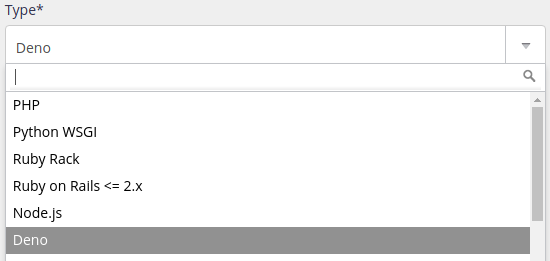

## Versions supportées

| |
|---|
| 2.8 |
| 2.7 |
| 2.6 |
| 2.2 |
| 2.1 |
| 1.46 |
| 1.45 |
| 1.43 |

La version par défaut est modifiable dans l'administration alwaysdata, **Environnement > Deno**. C'est cette version qui est notamment utilisée lorsque vous démarrez `deno`.

Les versions ne sont pas forcément [déjà installées](/fr/docs/hebergement-web/langages/#versions).

## Environnement

Votre environnement Deno est initialement vide, sans aucune bibliothèque préinstallée.

## Déploiement HTTP

Pour déployer une application HTTP avec Deno, créez un site de type *Deno* dans la section **Web > Sites**.



Vous devrez spécifier la commande qui démarre votre application Deno, par exemple :

```
deno run --allow-env --allow-net /home/[compte]/myapp/index.ts
```

> [!WARNING] Attention
> Votre application doit impérativement écouter sur l'ip et le port indiqués dans la vue de configuration du site sous le champ *Commande*. Vous pouvez utiliser les variables d'environnement `IP` / `HOST` et `PORT`.
