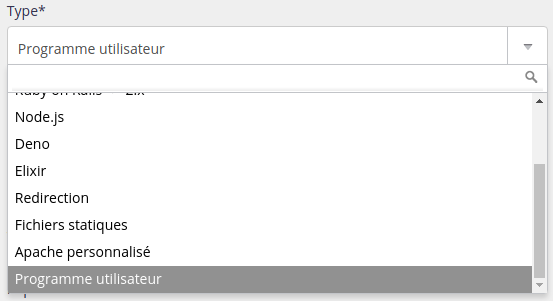

## Versions supportées

| |
|---|
|5.4|
|5.3|
|5.2|
|5.1|

La version par défaut est Lua 5.4. C'est cette version qui est notamment utilisée lorsque vous démarrez `lua`.

Les versions ne sont pas forcément [déjà installées](/fr/docs/hebergement-web/langages/#versions).

## Binaire à utiliser

Pour se servir d'une version de Lua différente que celle par défaut utilisez `lua5.X`.

## Environnement

[Luarocks](https://luarocks.org/) et [LuaJIT](http://luajit.org/) sont préinstallées.


## Déploiement HTTP

Pour déployer une application HTTP avec Lua, créez un site de type *[Programme utilisateur](/fr/docs/hebergement-web/sites/programme-utilisateur/)* dans la section **Web > Sites**.



Vous devrez spécifier la commande qui démarre votre application Lua, par exemple :

```
lua5.1 /home/[compte]/myapp/start-server.lua
```

> [!WARNING] Attention
> Votre application doit impérativement écouter sur l'ip `::` et le port indiqués dans la vue de configuration du site sous le champ *Commande* ; ou utiliser les variables d'environnement IP et PORT.
