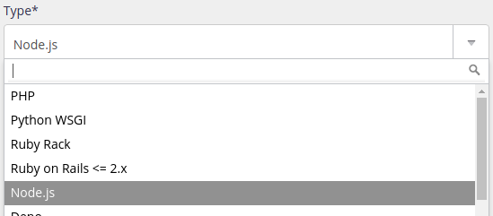

`[paquet]` est à remplacer par le nom du paquet à installer.

## Versions supportées

||
|---|
| 24 |
| 22 |
| 20 |
| 18 |
| 16 |
| 14 |
| 12 |
| 10 |
| 8  |
| 6  |

La version par défaut est modifiable dans l'administration, section **Environnement > Node.js**. C'est cette version qui est notamment utilisée lorsque vous démarrez `node`.

Versions ne sont pas forcément [déjà installées](/fr/docs/hebergement-web/langages/#versions).

> [!NOTE]
> Seules les **[versions LTS](https://nodejs.org/fr/about/previous-releases)** sont rendues disponibles.


## Binaire à utiliser

Vous devez toujours utiliser `node` (ou `/usr/bin/node`). `nodejs` ne fonctionne pas.

Pour forcer une version de Node.js différente de celle par défaut, définissez la variable d'environnement `NODEJS_VERSION` :

```sh
$ NODEJS_VERSION=12 node
```

Dans vos scripts, utilisez `/usr/bin/node` comme *shebang* :

```
#!/usr/bin/node
```

## Environnement

Votre environnement Node.js est initialement vide, sans aucune bibliothèque préinstallée. Vous pouvez utiliser `npm` pour installer des paquets :

```sh
$ npm install [paquet]
```

Vous pouvez également utiliser `npm` en mode global, les paquets seront installés dans le répertoire `/home/[compte]/.npm-packages` :

```sh
$ npm install -g [paquet]
```

## Déploiement HTTP

Pour déployer une application HTTP avec Node.js, créez un site de type *Node.js* dans la section **Web > Sites**.



Vous devrez spécifier la commande qui démarre votre application Node.js, par exemple :

```
node /home/[compte]/myapp/index.js
```

> [!WARNING] Attention
> Votre application doit impérativement écouter sur l'ip et le port indiqués dans la vue de configuration du site sous le champ *Commande*. Vous pouvez utiliser les variables d'environnement `IP` / `HOST` et `PORT`.
