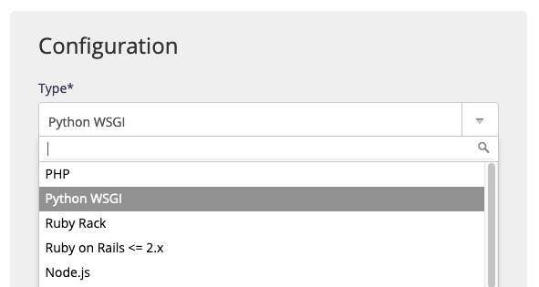

`[paquet]` et `[version]` sont à remplacer par le nom du paquet et de la version à installer.

## Versions supportées

||
|---|
|3.14 \|3.13 \| 3.12 \| 3.11 \| 3.10 \| 3.9 \| 3.8 \| 3.7 \| 3.6 \| 3.5 \| 3.4 \| 3.3 |
| 2.7 \| 2.6 \| 2.5 \| 2.4 |

La version par défaut est modifiable dans l'administration alwaysdata, **Environnement > Python**. C'est cette version qui est notamment utilisée lorsque vous démarrez `python`.

Les versions ne sont pas forcément [déjà installées](/fr/docs/hebergement-web/languages/#versions).

## Logs d'erreur

Python tourne derrière [uWSGI](https://uwsgi-docs.readthedocs.io/en/latest/), vous pouvez consulter les logs d'erreur dans le fichier `$HOME/admin/logs/uwsgi/[id].log`, où [id] est l'identifiant de votre site, indiqué dans la section **Web > Sites**.

Un extrait de ces logs est présenté dans l'interface d'administration alwaysdata (Logs - 📄).

## Binaire à utiliser

Vous devez toujours utiliser `python` (ou `/usr/bin/python`). N'utilisez jamais `python3`, `python2`, `python2.7`, ou toute autre commande.

Pour forcer une version de Python différente de celle par défaut, définissez la variable d'environnement `PYTHON_VERSION` :

```sh
$ PYTHON_VERSION=2.7 python
```

Dans vos scripts, utilisez `/usr/bin/python` comme *shebang* :

```
#!/usr/bin/python
```

Pour forcer une version de Python particulière :

```
#!/usr/bin/eval PYTHON_VERSION=2.7 python
```

Les autres binaires inclus dans Python (`2to3`, `pep8`, `pip`, `pydoc`...) fonctionnent de la même manière.

## Environnement

Votre environnement Python est initialement vide, sans aucune bibliothèque préinstallée en dehors de la bibliothèque standard. Vous pouvez utiliser `pip` pour installer des paquets, c'est l'outil standard de Python :

```sh
$ python -m pip install [paquet]
```

Les paquets sont installés dans le répertoire standard `$HOME/.local` et sont automatiquement ajoutés au `sys.path` par Python.

Attention, il faudra réinstaller les paquets si vous changez de version majeure de Python (3.5 et 3.6 sont deux versions majeures différentes, tandis que 3.5.1 et 3.5.2 ont la même version majeure).

Il est recommandé d'utiliser des environnements virtuels si vous utilisez plusieurs applications Python distinctes, de manière à ce que chacune ait son propre environnement isolé.

Avec Python 3, utilisez `venv` :

```sh
$ python -m venv myenv
```

Avec Python 2, utilisez `virtualenv` :

```sh
$ virtualenv myenv
```

Une fois votre environnement virtuel installé, vous pourrez l'activer avec :

```sh
$ source myenv/bin/activate
```

### Installer un paquet

Installer la dernière version d'un paquet :

```sh
$ python -m pip install [paquet]
```

Vous pouvez spécifier une version précise :

```sh
$ python -m pip install [paquet]==[version]
```

Pour installer un ensemble de paquets définis dans un fichier `requirements.txt` :

```sh
$ python -m pip install -r requirements.txt
```

### Désinstaller un paquet

```sh
$ python -m pip uninstall [paquet]
```

### Installer un paquet avec Distutils

Vous pouvez installer un paquet utilisant Distutils sans passer par pip :

```sh
$ python setup.py install --user
```

Si vous utilisez un environnement virtuel, il n'est pas nécessaire de spécifier `--user`.

## Déploiement WSGI

Pour qu'une application [WSGI](https://wsgi.readthedocs.io) soit accessible par le web, vous devez ajouter un site dans la section **Web > Sites** de l'administration :



* type : choisissez *Python WSGI* ;
* chemin de l'application : le chemin du fichier de votre application WSGI.

Vous pouvez également renseigner plusieurs champs optionnels :

* le répertoire de travail de votre application ;
* des variables d'environnement à définir ;
* une version de Python spécifique à utiliser ;
* le répertoire du virtualenv à utiliser.

## Déploiement ASGI

Les applications se basant sur la norme [ASGI](https://asgi.readthedocs.io) comme les frameworks Python asynchrone peuvent utiliser le type de site *[Programme utilisateur](/fr/docs/hebergement-web/sites/programme-utilisateur/)* dans la section **Web > Sites**. Le serveur HTTP le plus connu est [Uvicorn](https://www.uvicorn.org/).


Il faudra faire écouter le serveur HTTP en IPv6 et sur le port donné. Par exemple :

- Commande : `uvicorn example:app --reload --port $PORT --host $IP`

---

- [Déployer une application Fastapi (asyncio)](https://vincent.jousse.org/blog/fr/tech/comment-deployer-fastapi-chez-alwaysdata/) (guide d'un utilisateur de la plateforme)
