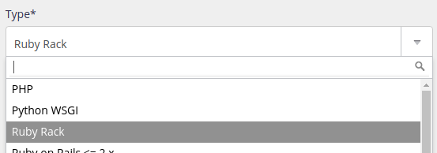

`[paquet]` et `[version]` sont à remplacer par le nom du paquet et de la version à installer.

## Versions supportées

|  |
| --- |
| 4.0 |
| 3.4 \| 3.3 \| 3.2 \| 3.1 \| 3.0 |
| 2.7 \| 2.6 \| 2.5 \| 2.4 \| 2.3 \| 2.2 \| 2.1 \| 2.0 |
| 1.9 \| 1.8 |

La version par défaut est modifiable dans l'administration, section **Environnement > Ruby**. C'est cette version qui est notamment utilisée lorsque vous démarrez `ruby`.

Les versions ne sont pas forcément [déjà installées](/fr/docs/hebergement-web/languages/#versions).

## Logs d'erreur

Ruby tourne derrière [uWSGI](https://uwsgi-docs.readthedocs.io/en/latest/), vous pouvez consulter les logs d'erreur dans le fichier `$HOME/admin/logs/uwsgi/[id].log`, où `[id]` est l'identifiant de votre site, indiqué dans la section **Web > Sites**.

Un extrait de ces logs est présenté dans l'interface d'administration alwaysdata (Logs - 📄).

## Binaire à utiliser

Vous devez toujours utiliser `ruby` (ou `/usr/bin/ruby`). N'utilisez jamais `ruby2.4` ou toute autre commande.

Pour forcer une version de Ruby différente de celle par défaut, définissez la variable d'environnement `RUBY_VERSION` :

```sh
$ RUBY_VERSION=2.3 ruby
```

Dans vos scripts, utilisez `/usr/bin/ruby` comme *shebang* :

```
#!/usr/bin/ruby
```

Pour forcer une version de Ruby particulière :

```
#!/usr/bin/eval RUBY_VERSION=2.3 ruby
```

Les autres binaires inclus dans Ruby (`gem`, `irb`, `ri`…) fonctionnent de la même manière.

## Environnement

Votre environnement Ruby est initialement vide, sans aucune bibliothèque préinstallée en dehors de la bibliothèque standard.

### Installer un paquet

Vous pouvez utiliser `gem` pour installer des paquets :

```sh
$ gem install [paquet]
```

Les paquets sont installés dans le répertoire standard `$HOME/.gem` et sont automatiquement ajoutés au load path par Ruby.

Attention, il faudra réinstaller les paquets si vous changez de version majeure de Ruby (2.3 et 2.4 sont deux versions majeures différentes, tandis que 2.3.1 et 2.3.0 ont la même version majeure).

Vous pouvez spécifier une version précise :

```sh
$ gem install [paquet] -v [version]
```

### Désinstaller un paquet

```sh
$ gem uninstall [paquet]
```

### Utiliser Bundler

Il est recommandé d'utiliser [Bundler](http://bundler.io/) si vous utilisez plusieurs applications Ruby distinctes, de manière à ce que chacune ait son propre environnement isolé. Bundle installe les paquets listés dans un fichier *Gemfile*.

```sh
$ bundle install
```

## Déploiement HTTP

Pour qu'une application Ruby soit accessible par le web, vous devez ajouter un site dans la section **Web > Sites** de l'administration alwaysdata. Nous proposons le type **Ruby Rack** qui utilise le serveur web [uWSGI](https://uwsgi-docs.readthedocs.io/en/latest/).



* type : choisissez *Ruby Rack* ;
* chemin de l'application : le chemin du fichier de votre application Rack.

Vous pouvez également renseigner plusieurs champs optionnels :

* utiliser Bundler ;
* des variables d'environnement à définir ;
* une version de Ruby spécifique à utiliser.

Vous pouvez utiliser un autre serveur web en le lançant en type [Programme utilisateur](/fr/docs/hebergement-web/sites/programme-utilisateur/).
