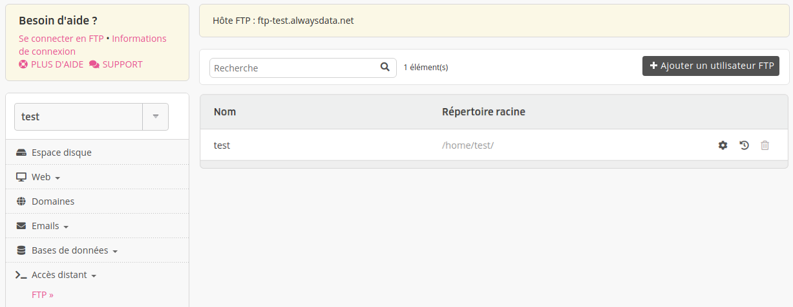

FTP, pour [File Transfer Protocol](https://fr.wikipedia.org/wiki/File_Transfer_Protocol) est un protocole permettant le partage de fichiers sur un réseau distant.

- [API - FTP](https://api.alwaysdata.com/v1/ftp/doc/)
- [Créer un utilisateur FTP](/fr/docs/hebergement-web/acces-distant/ftp/creer-un-utilisateur-ftp/)
- [Télécharger des fichiers avec FileZilla](/fr/docs/hebergement-web/acces-distant/ftp/utiliser-filezilla/)
- [Problèmes fréquents](/fr/docs/hebergement-web/acces-distant/ftp/problemes-frequents/)

## Se connecter en FTP

| Informations |                                     |
|--------------|-------------------------------------|
| Hôte         | **ftp-[compte].alwaysdata.net**         |
| Port         | **990 (SSL/TLS)**                   |
| Port alternatif | 21 (STARTTLS)                    |
| Identifiant  | **utilisateur** (**[compte]**) et **mot de passe** associé |

Ces utilisateurs sont paramétrables dans l'onglet **Accès distant > FTP** de votre interface d'administration alwaysdata.


Le nombre de connexions simultanées maximum par utilisateur est de _10_. Il est possible à la demande de le modifier en environnements Cloud Privé.

## .ftpaccess

Il est possible de créer des fichiers [.ftpaccess](http://www.proftpd.org/docs/howto/ftpaccess.html) pour modifier la configuration FTP des dossiers concernés.

### Exemple : Bloquer l'accès en lecture seule à un utilisateur

Créez un `.ftpaccess` à la racine du dossier avec la directive suivante :

```sh
<Limit WRITE>
DenyUser [utilisateur FTP]
</Limit>
```

## Divers

La plage de ports utilisée pour le mode passif est *53000-53999*.

---
- [FileZilla](https://filezilla-project.org/download.php) : client FTP gratuit
