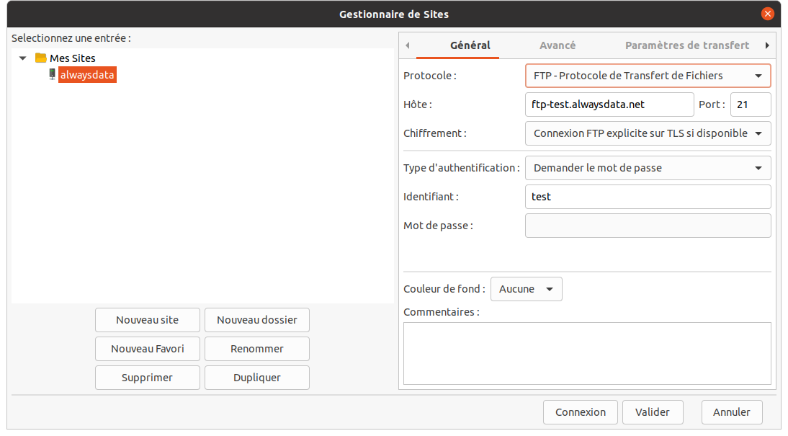
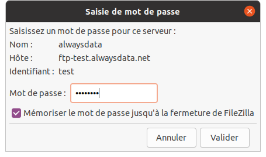
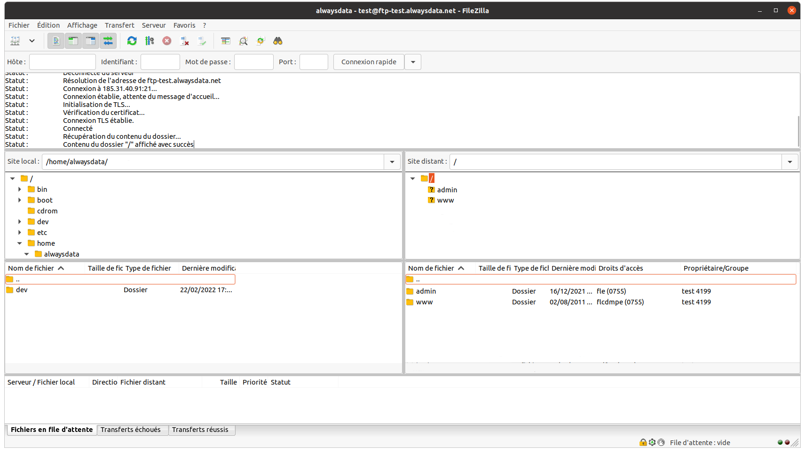

[Rappel des informations de connexion](/fr/docs/hebergement-web/acces-distant/ftp#se-connecter-en-ftp)

[FileZilla](https://filezilla-project.org/) est un client FTP gratuit fonctionnel sur tous les systèmes d'exploitation.

Dans notre exemple nous utilisons le compte `test` et son utilisateur FTP principal. C'est à remplacer par vos informations de connexion personnelles.

- Rendez-vous dans **Fichiers > Gestionnaire de Sites > Nouveau site**

- Renseignez-y vos informations de connexion (nom d'hôte, identifiant et port) puis cliquez sur **Connecter**
- Renseignez votre mot de passe

- La connexion s'effectue et vous n'avez plus qu'à faire des glisser-déposer du répertoire **Site Local** vers le répertoire **Site distant**.

Mettez les fichiers directement dans le répertoire `www`.
