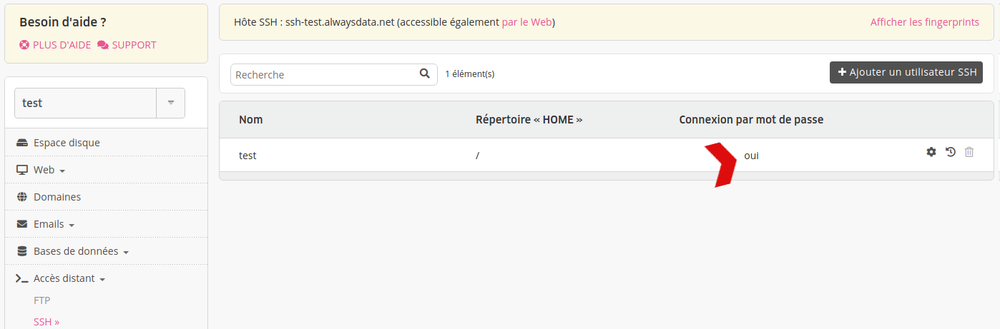
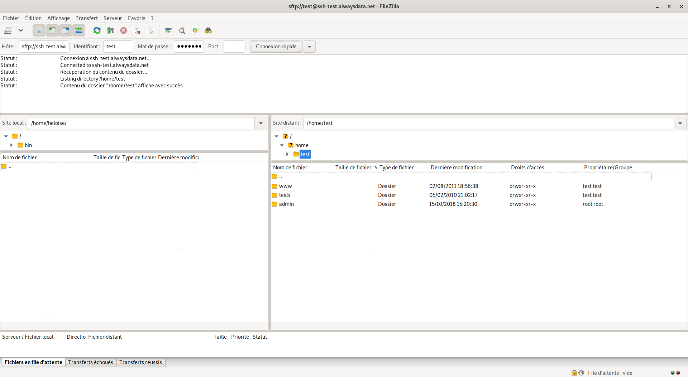

Le protocole SFTP (pour [SSH File Transfer Protocol](https://fr.wikipedia.org/wiki/SSH_File_Transfer_Protocol)) permet de sécuriser un transfert FTP en passant par un tunnel SSH. Les utilisateurs peuvent de ce fait utiliser une interface graphique simple via le client FTP de leur choix.

## Se connecter en SFTP

Dans **Accès distant > SSH/SFTP** autorisez la *connexion par mot de passe* à votre utilisateur SSH.

Puis renseignez dans votre client FTP les informations de connexion SSH. Prenons l'exemple du compte *test* et du client FTP [FileZilla](https://filezilla-project.org/) :

* utilisateur : `test`
* mot de passe
* nom d'hôte : `ssh-test.alwaysdata.net`
* port : `22`

## Divers

Les utilisateurs choisissant le shell **SFTP uniquement** sont `chroot`. Ce shell ne permet d'accéder aux répertoires `$HOME/admin/mail` et `$HOME/admin/backup`.

Il ne doit pas être confondu avec le protocole [FTPS](/fr/docs/hebergement-web/acces-distant/ftp/) : transfert FTP sécurisé par les protocoles SSL ou TLS.
