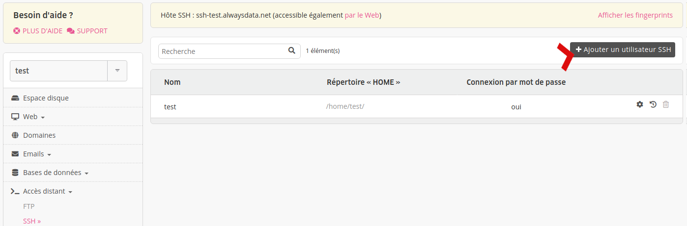
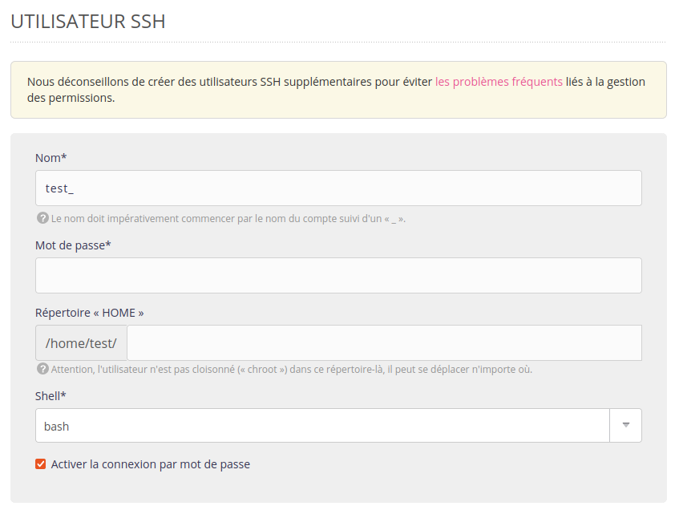

Afin de vous connecter à votre compte en _SSH_, il est nécessaire de disposer d'un utilisateur. Par défaut, un utilisateur du nom de votre _compte_ est crée à sa création. Vous pouvez administrer vos utilisateurs SSH depuis votre interface d'administration, onglet **Accès distant > SSH**.

- Nom : nom de l'utilisateur SSH, préfixé du nom de votre compte ;
- Mot de passe : mot de passe associé à l'utilisateur. Il est nécessaire pour la première connexion SSH ; la [connexion par clés](/fr/docs/hebergement-web/acces-distant/ssh/utiliser-des-cles-ssh/) peut ensuite être utilisée ;
- Répertoire "HOME" : répertoire dans lequel l'utilisateur arrive à sa connexion ;
- [Shell](https://fr.wikipedia.org/wiki/Shell_Unix) : interpréteur de commande de votre utilisateur.

> [!NOTE]
> Contrairement à FTP, SSH ne propose aucune isolation. Ainsi, l'utilisateur pourra circuler librement dans l'ensemble des répertoires du compte.

> [!NOTE]
> Même si ce n'est pas préconisé pour des problématiques de droits sur les dossiers et fichiers, vous pouvez créer autant d'utilisateurs SSH que vous le souhaitez.
