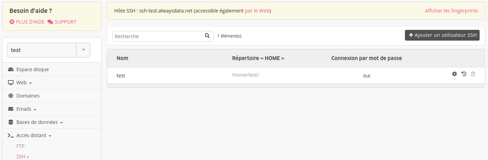

SSH, pour [Secure Shell](https://fr.wikipedia.org/wiki/Secure_Shell), est un protocole de connexion sécurisé par un échange de clés de chiffrement en début de connexion. alwaysdata le propose sur TOUS ses environnements.

**L'accès distant par SSH est désactivé par défaut.** Pour l'activer, modifiez votre utilisateur et cochez la connexion par mot de passe. Il est ensuite possible de mettre en place une connexion par [clés SSH](/fr/docs/hebergement-web/acces-distant/ssh/utiliser-des-cles-ssh/) et désactiver la connexion par mot de passe.

- [API - SSH](https://api.alwaysdata.com/v1/ssh/doc/)
- [Créer un utilisateur SSH](/fr/docs/hebergement-web/acces-distant/ssh/creer-un-utilisateur-ssh/)
- [Problèmes fréquents](/fr/docs/hebergement-web/acces-distant/ssh/problemes-frequents/)

* Utilisateurs de [Cloud privé](/fr/docs/admin-facturation/facturation/prix-cloud-prive/) :
	- [Authentification 2 facteurs SSH](/fr/docs/hebergement-web/acces-distant/ssh/authentification-2-facteurs-ssh/)
	- [Clés SSH globales](/fr/docs/hebergement-web/acces-distant/ssh/cles-ssh-globales/)

> [!NOTE]
> Toutes nos offres sont infogérées, il n'est pas possible d'avoir un accès `root`.


## Se connecter en SSH

| Informations |                                                 |
|--------------|-------------------------------------------------|
| Hôte         | ssh-[compte].alwaysdata.net                     |
| Ports        | 22                                              |
| Identifiant  | utilisateur et mot de passe associé OU clés SSH |

Ces utilisateurs sont paramétrables dans l'onglet **Accès distant > SSH/SFTP** de votre interface d'administration alwaysdata (dont leurs [shell](https://fr.wikipedia.org/wiki/Shell_Unix)). Vous y retrouverez aussi les _fingerprints_ du serveur SSH sur lequel est le compte.


### Par un terminal

Ouvrez votre terminal et saisissez la commande suivante :

```ssh
$ ssh [utilisateur]@ssh-[compte].alwaysdata.net
```

> [!NOTE]
> Remplacez `[utilisateur]` par le nom de votre utilisateur SSH et `ssh-[compte].alwaysdata.net` par votre nom d'hôte SSH.


### Par le web

Utile si vous êtes derrière un firewall, notre [interface web](https://tsl0922.github.io/ttyd/) vous permet d'utiliser le protocole SSH à partir de votre navigateur. Pour l'utiliser, indiquez `https://ssh-[compte].alwaysdata.net` dans la barre d'adresse de votre navigateur web.

Attention, cette solution peu fiable et lente ne remplace pas un client SSH.

> [!NOTE]
> Cette interface n'est pas compatible avec le [Cloud Privé](/fr/docs/admin-facturation/facturation/prix-cloud-prive/).


## Divers

Les *fingerprints* de nos serveurs SSH sont affichés dans l’onglet **Accès distant > SSH/SFTP** de votre interface d’administration.

Les processus en cours sont accessible via le menu **Avancé > Processus > SSH**.

Les utilisateurs SSH ne sont pas `chroot`. Même si le répertoire racine de l'utilisateur n'est pas la racine du compte, il pourra accéder au compte entier. Pour utiliser `chroot` tournez-vous vers [SFTP](/fr/docs/hebergement-web/acces-distant/sftp/) ou [FTP](/fr/docs/hebergement-web/acces-distant/ftp/).

---
- [OpenSSH](https://www.openssh.com/) ;
- [PuTTY](https://www.chiark.greenend.org.uk/~sgtatham/putty/download.html) : terminal SSH sous Windows.
