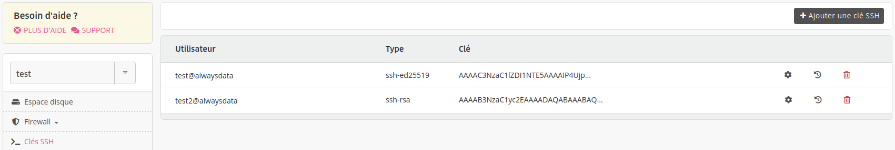

> [!NOTE]
> Fonctionnalité accessible uniquement sur les environnements [Cloud privé](/fr/docs/admin-facturation/facturation/prix-cloud-prive/).

Pour gérer facilement les comptes de son serveur, vous pouvez installer des clés SSH globales dans l'onglet **Clés SSH** de votre serveur. Elles permettent de se connecter à n'importe quel compte sans connaître son mot de passe.

Votre clé SSH publique à copier sur ce formulaire est disponible dans un fichier du répertoire `$HOME/.ssh` de votre ordinateur (par exemple `$HOME/.ssh/id_ed25519.pub`). Si vous n'en avez pas vous pouvez la [générer](/fr/docs/hebergement-web/acces-distant/ssh/utiliser-des-cles-ssh/).
