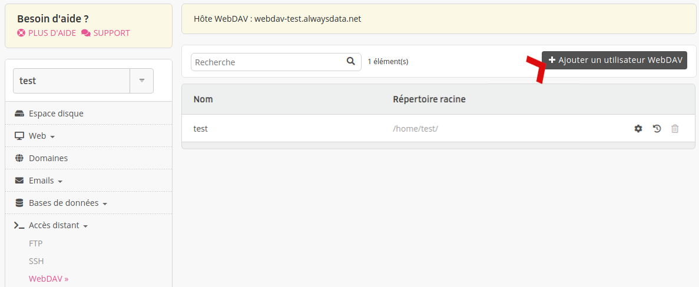

Afin de vous connecter à votre compte en _WebDAV_, il est nécessaire de disposer d'un utilisateur. Par défaut, un utilisateur du nom de votre `[compte]` est crée à sa création. Vous pouvez créer autant d'utilisateurs WebDAV que vous le souhaitez que vous pouvez administrer depuis votre interface d'administration, onglet **Accès distant > WebDAV**.

- Nom : nom de l'utilisateur WebDAV, préfixé du nom de votre compte ;
- Mot de passe : mot de passe associé à l'utilisateur ;
- Répertoire racine : répertoire dans lequel l'utilisateur arrive à sa connexion.

> [!NOTE]
> WebDAV propose une isolation : l'utilisateur ne pourra pas circuler librement sur les répertoires parents de son répertoire racine.
