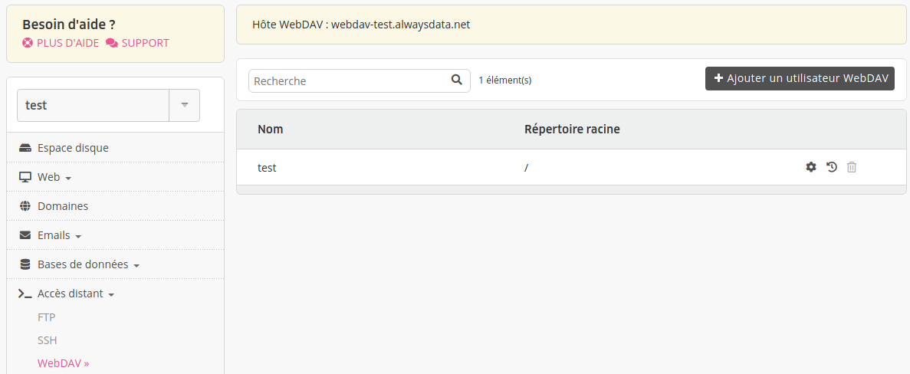

WebDAV, pour [Web-based Distributed Authoring and Versioning](http://www.webdav.org/), permet aux utilisateurs de modifier et de gérer en collaboration des fichiers sur des serveurs Web distants.

- [API - WebDAV](https://api.alwaysdata.com/v1/webdav/doc/)
- [Créer un utilisateur WebDAV](/fr/docs/hebergement-web/acces-distant/webdav/creer-un-utilisateur-webdav/)

## Se connecter avec WebDAV

|Informations||
|---|---|
|Hôte|webdav-[compte].alwaysdata.net|
|Ports|80 (HTTP) ou 443 (HTTPS)|
|Identifiant|**utilisateur** (**[compte]**) et **mot de passe** associé|

Ces utilisateurs sont paramétrables dans l'onglet **Accès distant > WebDAV** de l'interface d'administration.


### Avec Windows

1. Faites un clic droit sur l'icône **Poste de travail** ou **Ordinateur** ;
2. Choisissez **Connecter un lecteur réseau**. Dans le champ _Dossier_, indiquez :
    - sous Vista et supérieurs : `https://webdav-[compte].alwaysdata.net/` 
3. Cliquez sur _Se connecter_ sous un nom d'utilisateur différent, puis entrez les identifiants de l'utilisateur WebDAV. Validez et cliquez sur _Terminer_.

### Avec macOS
1. Dans le **Finder**, choisissez _Aller > Se connecter au serveur_ ;
2. Dans le champ _Adresse du serveur_, entrez `https://webdav-[compte].alwaysdata.net/` ;
3. Cliquez sur _Connexion_ puis _Se connecter_ dans le second dialogue pour continuer, puis comme « Utilisateur référencé » entrez le nom et le mot de passe de l'utilisateur WebDAV et cliquez sur _Se connecter_.

### Avec rclone (Linux / macOS)

[**rclone**](https://rclone.org/) est un outil puissant pour synchroniser et gérer les fichiers sur des services de stockage cloud et des partages réseau, y compris WebDAV.

#### Installation

Téléchargez et installez rclone :

```sh
$ curl https://rclone.org/install.sh | sudo bash
```

Ou utilisez votre gestionnaire de paquets :

```sh
# Debian/Ubuntu
$ sudo apt install rclone

# Fedora/RHEL
$ sudo dnf install rclone

# macOS
$ brew install rclone
```

#### Configuration

Créez une configuration rclone interactive :

```sh
$ rclone config
```

Sélectionnez l'option pour créer un nouveau remote et choisissez le type **webdav**. Ensuite :

1. Nommez votre remote (ex: `alwaysdata`) ;
2. Entrez l'URL de votre serveur WebDAV : `https://webdav-[compte].alwaysdata.net/` ;
3. Entrez votre identifiant WebDAV (format : `[compte](_…)`) ;
4. Entrez votre mot de passe WebDAV ;
5. Confirmez les paramètres et enregistrez la configuration.

#### Utilisation

Une fois configuré, vous pouvez :

**Lister les fichiers :**
```sh
$ rclone ls alwaysdata:
```

**Monter comme système de fichiers :**
```sh
$ mkdir -p ~/alwaysdata
$ rclone mount [--daemon] --vfs-cache-mode writes alwaysdata: ~/alwaysdata
```
L'option `--daemon` lance le processus sous forme de démon et rend la main.
Si vous rencontrez l'erreur `Fatal error: failed to mount FUSE fs: fusermount: exec: "fusermount": executable file not found in $PATH` installez le paquet `fuse3`.

**Synchroniser les fichiers :**
```sh
# Télécharger depuis alwaysdata
$ rclone sync alwaysdata:/ ~/Documents/backup/

# Envoyer vers alwaysdata
$ rclone sync ~/Documents/ alwaysdata:/
```

> [!NOTE]
> Remplacez `webdav-[compte].alwaysdata.net` par votre nom d'hôte WebDAV, disponible dans **Accès distant > WebDAV**.
