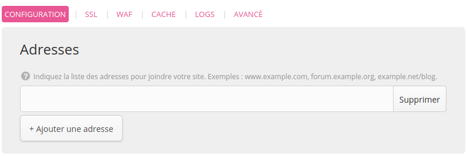
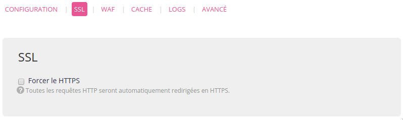
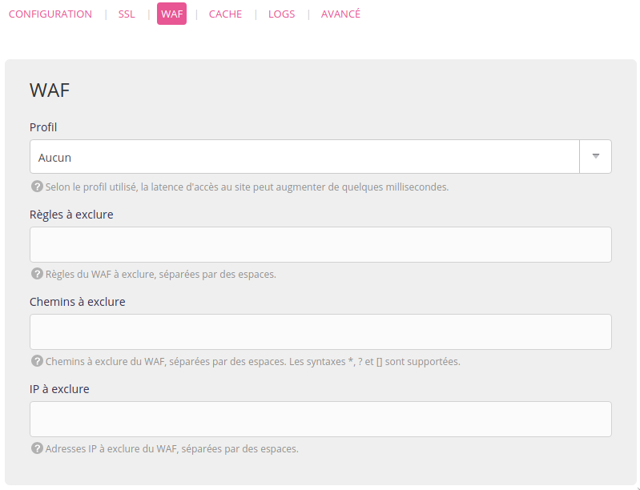
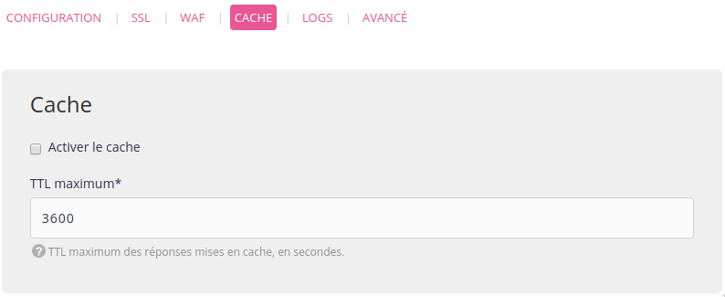
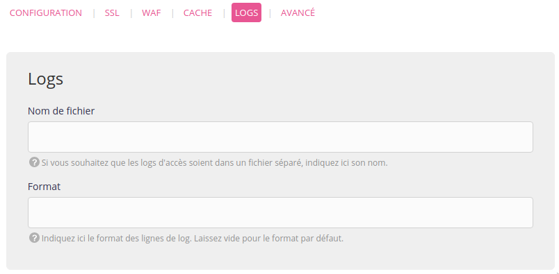
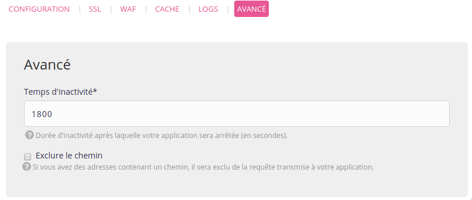

Rendez-vous dans le menu **Web > Sites > Ajouter un site**.

> [!TIP] Astuce
> Si vous partez de zéro vous pouvez profiter de notre [marketplace](/fr/docs/developpement/marketplace) en allant dans **Web > Sites > Installer une application**.

## Adresses
L'ajout de toutes les adresses dans ce menu est un **impératif** pour qu'elles soient accessibles comme sites :
- par exemple, pour accéder à un site sur *www\.example.org* et *example.org* les deux adresses doivent être ajoutées ;
- renseigner son domaine dans le menu **Domaines** n'est pas non plus suffisant. Même pour un domaine utilisant nos [serveurs DNS](/fr/docs/domaines/#gestion-dns).

Par ailleurs, si le domaine n'utilise pas nos serveurs DNS, il faudra [créer des enregistrements DNS](/fr/docs/hebergement-web/sites/utiliser-des-adresses-externes/) chez le prestataire DNS.

> [!NOTE]
> L'ajout du site ne va pas créer le *répertoire racine*, il doit être créé par [accès distant](/fr/docs/hebergement-web/acces-distant/).

Pour créer un catch-all indiquez `*.example.org`.

## Configuration
Spécifique à chaque type de site :
- [PHP](/fr/docs/hebergement-web/langages/php/) ;
- [Python WSGI](/fr/docs/hebergement-web/langages/python/) ;
- [Ruby Rack](/fr/docs/hebergement-web/langages/ruby/) ;
- Ruby on Rails <= 2.x ;
- [Node.js](/fr/docs/hebergement-web/langages/nodejs/) ;
- [Elixir](/fr/docs/hebergement-web/langages/elixir/) ;
- [Deno](/fr/docs/hebergement-web/langages/deno/) ;
- [.NET](/fr/docs/hebergement-web/langages/dotnet/) ;
- [Java](/fr/docs/hebergement-web/langages/java/) ;
- [Redirection](/fr/docs/hebergement-web/sites/redirection/) ;
- Reverse proxy : met en place un reverse proxy vers une URL ;
- [Fichiers statiques](/fr/docs/hebergement-web/sites/fichiers-statiques/) : pour gérer des sites ou fichiers statiques ;
- [Apache personnalisé](/fr/docs/hebergement-web/sites/apache-personnalise/) : pour totalement configurer son serveur Apache ;
- [Programme utilisateur](/fr/docs/hebergement-web/sites/programme-utilisateur/) : pour faire tourner n'importe quel serveur web.

Les sites de type PHP, Fichiers statiques et Apache personnalisé sont servis par [Apache](https://httpd.apache.org/). Python WSGI, Ruby Rack et Ruby on Rails <= 2.x utilisent [uWSGI](https://uwsgi-docs.readthedocs.io/en/latest/).

## SSL

Voir [SSL](/fr/docs/hebergement-web/sites/ssl-tls/rediriger-HTTP-vers-HTTPS/).

## WAF

Voir [WAF](/fr/docs/hebergement-web/sites/waf/).

## Cache

Voir [Cache](/fr/docs/hebergement-web/sites/cache-http/).

## Logs

Voir [Logs](/fr/docs/hebergement-web/sites/formater-les-logs-http/).

## Avancé

> [Temps d'inactivité](/fr/docs/hebergement-web/sites/divers/#temps-dinactivité)

---

Les logs HTTP sont disponibles dans le répertoire `$HOME/admin/logs/http/`. Les logs _sites_ reprenant les lancements, arrêts et dysfonctionnements des serveurs web "upstream" sont disponibles dans `$HOME/admin/logs/sites/`. Un extrait de ces logs (ainsi que les logs Apache et uWSGI) est présenté dans l'interface d'administration alwaysdata  (**Logs** - 📄).
