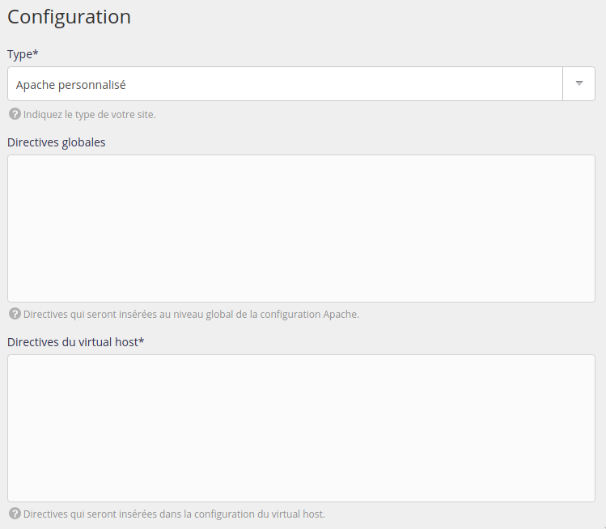

Le type Apache personnalisé permet de faire tourner des sites servis par le serveur Apache mais n'utilisant pas PHP ou HTML.

> [!WARNING] Attention
> Si vous voulez seulement ajouter des directives globales à Apache modifiez sa [configuration](/fr/docs/hebergement-web/sites/configurer-apache/) dans **Web > Configuration > Apache**.

Rendez-vous dans le menu **Web > Sites > Ajouter un site**.

- Nom : utilisé pour l'affichage dans l'interface d'administration alwaysdata, purement informatif ;
- Adresses : les adresses pour joindre votre site (`*.example.org` pour les _catch-all_) ;

- Type : Apache personnalisé ;
- Directives globales : directives globales à tous les sites servis par Apache ;
- Directives du virtual host : directives Apache pour le site concerné.

L'ensemble des modifications se répercutera dans le fichier `/home/[compte]/admin/config/apache/sites.conf`. Les logs d'erreurs Apache sont disponibles dans `/home/[compte]/admin/logs/apache/apache.log`.
