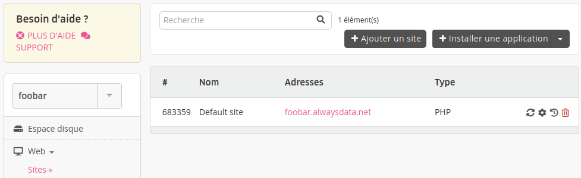
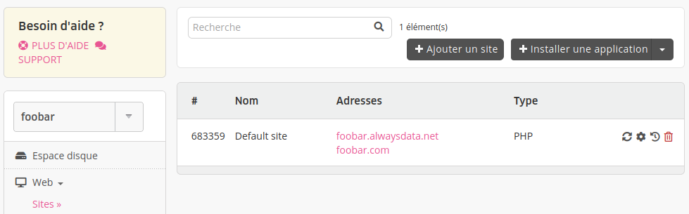
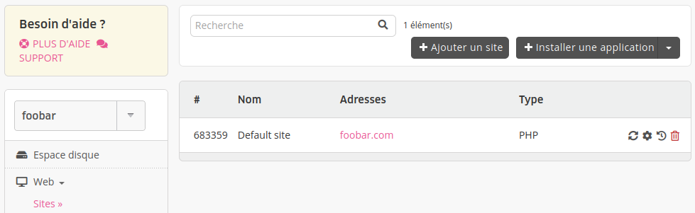

Votre site pointe sur une adresse et vous souhaitez utiliser une autre adresse/un autre domaine. Voici les étapes à suivre :

Dans cet exemple, l'adresse de base sera `foobar.alwaysdata.net` et la nouvelle adresse `foobar.com`. 

> [!NOTE]
> Les adresses `.alwaysdata.net` ne seront pas un choix possible.

1. Faire pointer les adresses de votre domaine sur nos serveurs :

    - si le domaine n'existe pas, il faut [l'acheter](/fr/docs/domaines/acheter-un-domaine/) ;
    - si le domaine existe, vous pouvez :
        - n'ajouter que les [adresses nécessaires](/fr/docs/hebergement-web/sites/utiliser-des-adresses-externes/) au site web ;
        - passer toute la [gestion technique](/fr/docs/domaines/ajouter-un-domaine-externe/) sur nos serveurs DNS ;
        - [transférer](/fr/docs/domaines/transferer-un-domaine/) le domaine ;
        
2. Ajouter les nouvelles adresses au site dans **Web > Sites** - l'ancienne est toujours présente ;

3. Modifier l'adresse au niveau de l'application (dans son interface d'administration par exemple) ;

4. Supprimer l'ancienne adresse dans **Web > Sites**. Ce dernier point n'est *pas indispensable*, si vous ne le faites pas le site restera juste accessible sur l'ancienne adresse - tant qu'elle pointe sur nos serveurs.

