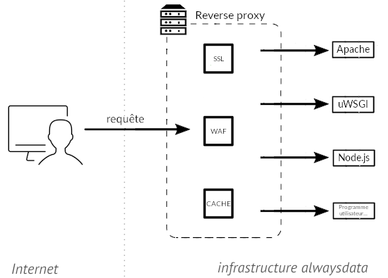

Un reverse-proxy frontal est installé sur tous nos serveurs. Celui-ci écoute les requêtes HTTP entrantes puis :

- lance les serveurs HTTP et programmes [définis](/fr/docs/hebergement-web/sites/ajouter-un-site/) pour servir vos données ;
- renvoie le bon [certificat SSL](/fr/docs/hebergement-web/sites/ssl-tls/certificates-priorities) ;
- logue les requêtes HTTP. Ces logs sont disponibles via le [répertoire `$HOME/admin/logs`](/fr/docs/hebergement-web/acces-distant/repertoire-admin/#logs).

Il gère aussi le [pare-feu applicatif web (WAF)](/fr/docs/hebergement-web/sites/waf/) et le [cache HTTP](/fr/docs/hebergement-web/sites/cache-http/) activables dans **Web > Sites**.

 Nous ajoutons aux *headers* :

- `X-Forwarded-Proto`, qui vaut http ou https selon que la connexion est faite en HTTP ou HTTPS. Ainsi le reverse proxy accède aux serveurs web en HTTP que la connexion au niveau du navigateur soit HTTP ou HTTPS ;
- `X-Real-IP`, qui prend la valeur de l'adresse IP de l'utilisateur.

---
Icônes : The Noun Project
