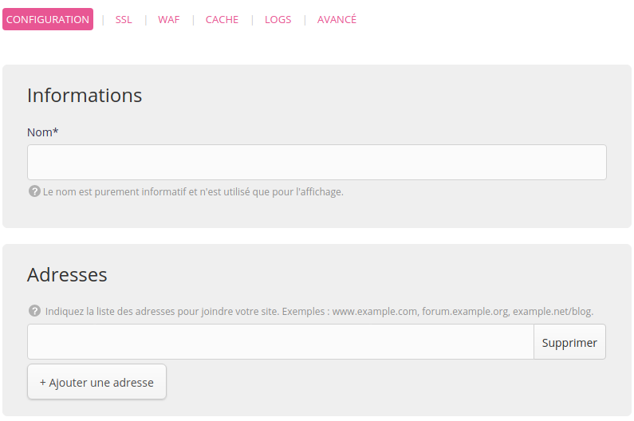
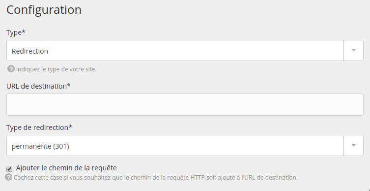

Rendez-vous dans le menu **Web > Sites > Ajouter un site**.

- Nom : utilisé pour l'affichage dans l'interface d'administration alwaysdata, purement informatif ;
- Adresses : les adresses pour joindre votre site (`*.example.org` pour les _catch-all_) ;

- Type : Redirection ;
- URL de destination : adresse vers laquelle la redirection sera faite ;
- Type de redirection :
     - permanente (code HTTP `301`) : pour un usage classique, rediriger un visiteur d'une adresse A vers une adresse B. Les moteurs de recherche qui mettent à jour leur index avec la nouvelle page de destination ;
     - temporaire (code HTTP `302`) : généralement utilisé lors de maintenance d'un site. Les moteurs de recherche conservent la page de départ dans leur index ;
- Ajouter le chemin de la requête à l'URL de destination.

## Rediriger via Apache

Pour les sites de type PHP, Fichiers statiques et Apache personnalisé, vous pouvez aussi utiliser un fichier `.htaccess` et la directive [Redirect](https://httpd.apache.org/docs/2.4/fr/mod/mod_alias.html#redirect).

## Rediriger via uWSGI

Pour les sites de type Python WSGI, Ruby Rack et Ruby on Rails <= 2.x, vous pouvez également utiliser la méthode [InternalRouting](https://uwsgi-docs.readthedocs.io/en/latest/InternalRouting.html) et son plugin `router-redirect` dans la configuration avancée du site.
