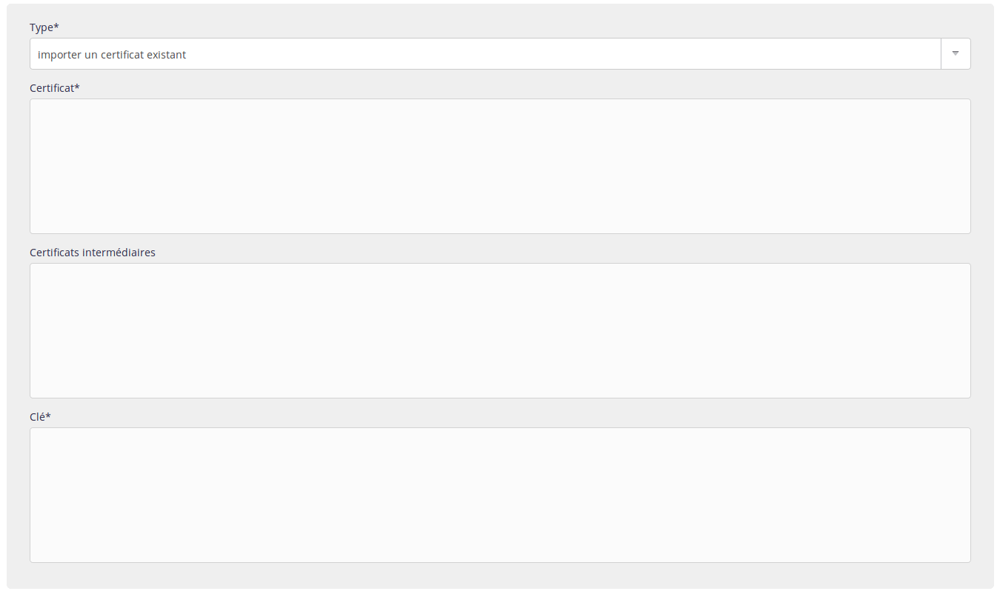

Ajoutez votre certificat dans la section **Avancé > Certificats SSL > Ajouter un certificat SSL** de votre interface alwaysdata.

Clé privée, certificat et certificats intermédiaires doivent être au format PEM.

Vous pouvez ajouter des certificats pour une adresse précise, des certificats [SAN](https://en.wikipedia.org/wiki/Subject_Alternative_Name) (multi-domaines) ou encore des certificats [wildcard](https://en.wikipedia.org/wiki/Wildcard_certificate).

Si vous n'avez pas de certificat SSL, vous pouvez utiliser nos [certificats Let's Encrypt](/fr/docs/hebergement-web/sites/ssl-tls/certificats-lets-encrypt/) ou en acheter un chez un fournisseur de certificats SSL en lui donnant la [CSR précédemment créée](/fr/docs/hebergement-web/sites/ssl-tls/generer-csr/).
