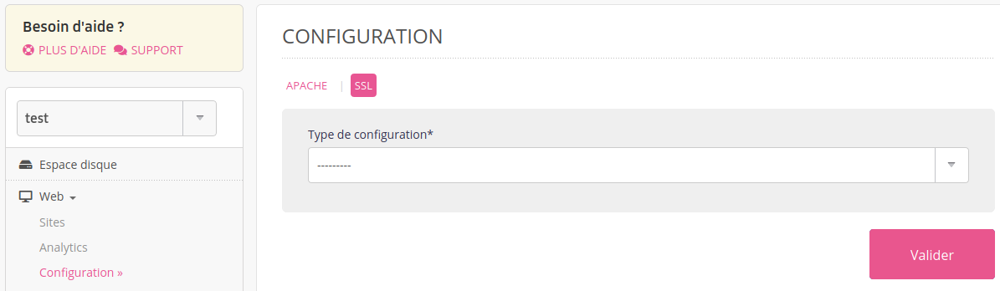
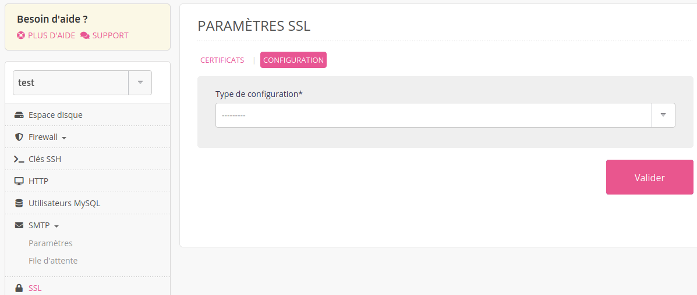

[TLS](https://fr.wikipedia.org/wiki/Transport_Layer_Security) est un protocole cryptographique de sécurisation des échanges sur internet.

Trois profils pour les connexions HTTP sont possibles :

- _Moderne_ : seulement TLS 1.3. Compatible avec les navigateurs les plus récents ;
- _Intermédiaire_ : les versions de TLS supérieures à la 1.2 sont activées ce qui permet d'être compatible avec la plupart des navigateurs ;
- _Ancien_ : toutes les versions de TLS sont activées ce qui permet d'être compatible avec les navigateurs les plus anciens.

> [!NOTE]
> Le profil _Intermédiaire_ est activé par défaut sur les serveurs d'alwaysdata.

Pour changer de profil TLS au niveau du compte il faut modifier le profil dans l'onglet **Web > Configuration > SSL** :

## Cloud Privé

Les propriétaires de [Cloud Privés](/fr/docs/admin-facturation/facturation/prix-cloud-prive/) peuvent configurer le profil TLS HTTP au niveau du _serveur_ dans l'onglet **SSL > Configuration** :

