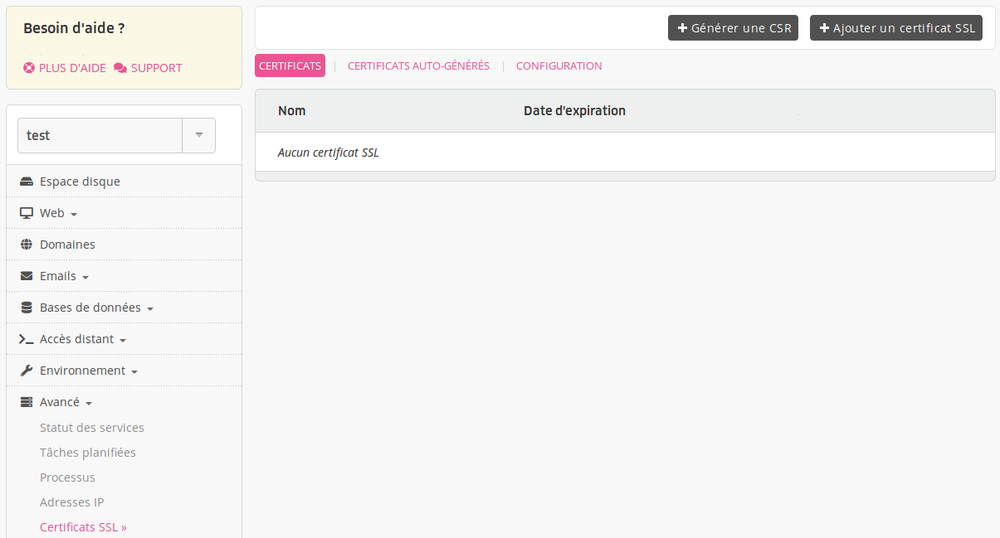
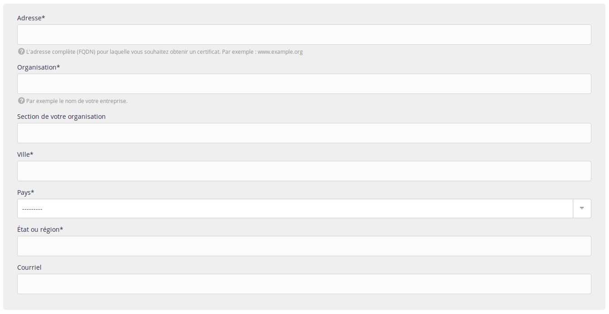

Une CSR (Certificate Signing Request ou [Demande de signature de certificat](https://fr.wikipedia.org/wiki/Demande_de_signature_de_certificat)) vous sera demandée lors de l'achat d'un certificat.

Pour la générer, rendez-vous dans le menu **Avancé > Certificats SSL > Générer une CSR**.

