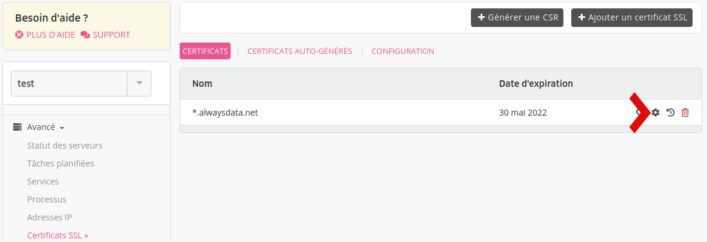
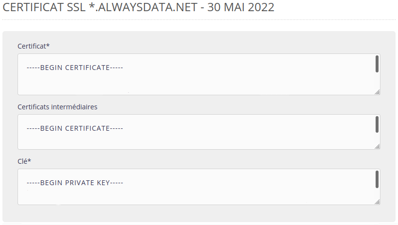

Lorsque vous renouvelez le certificat SSL chez votre fournisseur, celui-ci doit vous livrer un fichier contenant le nouveau certificat.

Sur votre interface alwaysdata - onglet **Avancé > Certificats SSL** - modifiez alors le certificat actuel.

Changez le champ **Certificat** pour y mettre le contenu du fichier donné par votre fournisseur de certificat SSL.

Le certificat est maintenant mis à jour et sa nouvelle date d'expiration sera affichée.
