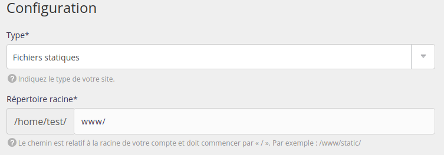

Que ce soit pour gérer un site statique, comme un site HTML, ou pour servir des médias d'un site utilisant uWSGI, vous pouvez utiliser le type Fichiers statiques.

Rendez-vous dans le menu **Web > Sites > Ajouter un site**.

- Nom : utilisé pour l'affichage dans l'interface d'administration alwaysdata, purement informatif ;
- Adresses : les adresses pour joindre votre site (`*.example.org` pour les _catch-all_) ;

- Type : Fichiers statiques ;
- Répertoire racine : répertoire dans lequel est placé votre application.

## Messages d'erreurs

### 403 Forbidden

Par défaut, le serveur HTTP va rechercher pour la page d'accueil un fichier nommé `index.html`. Renommez votre fichier ou utilisez la directive [DirectoryIndex](https://httpd.apache.org/docs/2.4/fr/mod/mod_dir.html#directoryindex) dans un `.htaccess`.
