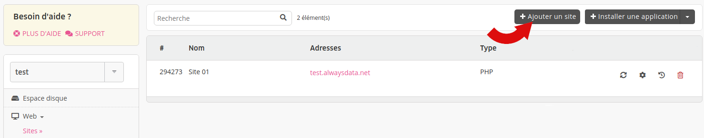
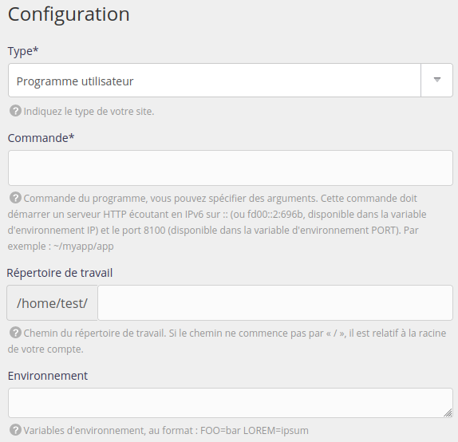

Pour lancer un programme web n'utilisant pas un des autres types de site vous pouvez avoir recours au _Programme utilisateur_.

Il pourra être utilisé pour les langages [Erlang](https://www.erlang.org/), [Go](/fr/docs/hebergement-web/langages/go/), [Java](/fr/docs/hebergement-web/langages/java/), [Lua](/fr/docs/hebergement-web/langages/lua/), [Rust](/fr/docs/hebergement-web/langages/rust/), [Scala](https://www.scala-lang.org/), ou encore bien d'autres...[^1]

Rendez-vous dans le menu **Web > Sites > Ajouter un site**.

- Nom : utilisé pour l'affichage dans l'interface d'administration alwaysdata, purement informatif ;
- Adresses : les adresses pour joindre votre site (`*.example.org` pour les _catch-all_) ;

- Type : Programme utilisateur ;
- Commande : commande à effectuer pour lancer le programme. Le serveur HTTP de votre programme doit pointer sur l'IP et le port donnés dans le texte explicatif ;
- Répertoire de travail ;
- Environnement : variables d'environnement permettant le fonctionnement du programme.

> [!TIP] Astuce
> Avant de mettre en place le site, vous pouvez tester le lancement du programme en [SSH](/fr/docs/hebergement-web/acces-distant/ssh/).

Si le programme ne se lance pas, les logs _sites_ disponibles dans le répertoire `$HOME/admin/logs/sites/` pourront vous aider.

[^1]: Par exemple, [Nginx](https://www.nginx.com/), [LiteSpeed](https://www.litespeedtech.com/) ou [Varnish](https://varnish-cache.org/) sont utilisables sur les serveurs *alwaysdata*. L'installation et la configuration sont à votre charge.
